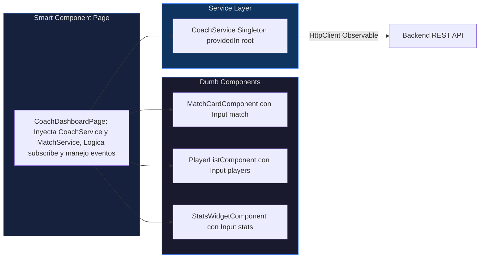
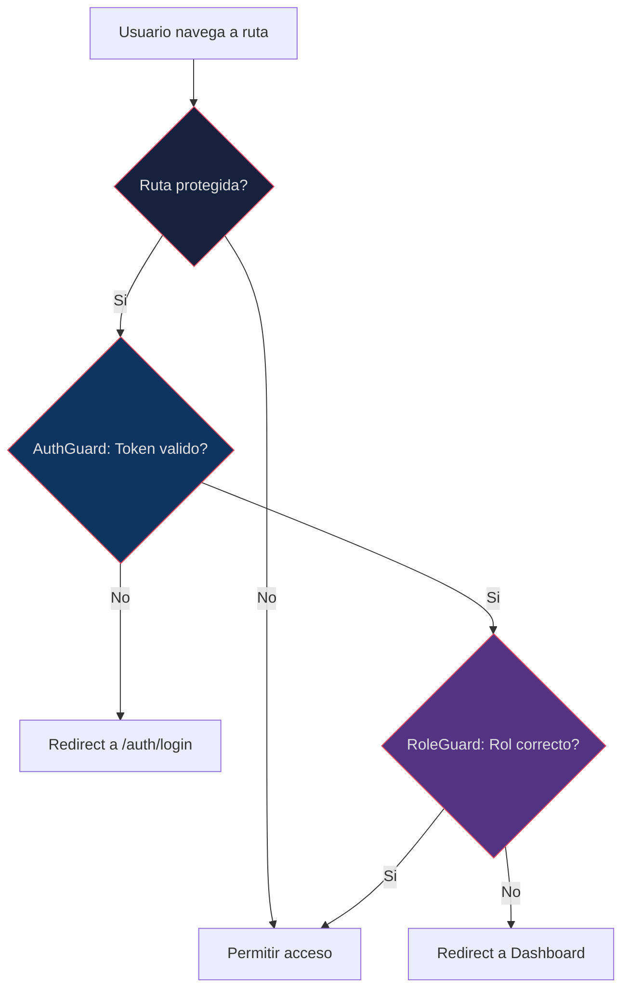

# 📗 FRONTEND.md — Documentación Técnica del Frontend

<div align="center">

**DAM United FC · Angular 16 · Ionic 7 · RxJS · TypeScript**

</div>

---

## 📋 Índice

1. [Arquitectura Modular](#-arquitectura-modular)
2. [Lazy Loading y Routing](#-lazy-loading-y-routing)
3. [Core Module (Singleton)](#-core-module)
4. [Feature Modules](#-feature-modules)
5. [Patrón Smart-Dumb Components](#-patrón-smart-dumb-components)
6. [Servicios HTTP (Capa de Datos)](#-servicios-http)
7. [Guards e Interceptors](#-guards-e-interceptors)
8. [Gestión de Estado con RxJS](#-gestión-de-estado-con-rxjs)
9. [UI Adaptativa (Ionic Components)](#-ui-adaptativa)
10. [Configuración de Entorno](#-configuración-de-entorno)

---

## 🏗️ Arquitectura Modular

```mermaid
graph TB
    subgraph Root["AppModule"]
        AR["AppRoutingModule Lazy Loading"]
        AC["AppComponent"]
    end

    subgraph Core["Core Singleton"]
        direction TB
        G["Guards: Auth, NoAuth, Role"]
        I["Interceptors: Auth, Error"]
        S["Services 18+: Auth, Storage, Admin, Coach, Match, Open, Player, Team"]
    end

    subgraph Features["Feature Modules Lazy Loaded"]
        direction TB
        M1["LandingModule"]
        M2["AuthModule"]
        M3["AdminModule"]
        M4["CoachModule"]
        M5["PlayerModule"]
        M6["UserModule"]
        M7["CalendarModule"]
        M8["ClubModule"]
        M9["MatchDetailModule"]
        M10["DashboardModule"]
    end

    subgraph Shared["SharedModule"]
        SM["Componentes reutilizables, Pipes, Modelos, Interfaces"]
    end

    AR --> M1 & M2 & M3 & M4 & M5 & M6 & M7 & M8 & M9 & M10
    Core --> Features
    Shared --> Features

    style Root fill:#1a1a2e,stroke:#3880ff,color:#e0e0e0
    style Core fill:#0f3460,stroke:#3880ff,color:#e0e0e0
    style Features fill:#16213e,stroke:#3880ff,color:#e0e0e0
    style Shared fill:#533483,stroke:#3880ff,color:#e0e0e0
```



### Estructura de directorios

```
frontend/src/app/
├── app.module.ts                # Root module
├── app-routing.module.ts        # Lazy loading routes (15+ rutas)
├── app.component.ts/html/scss   # Root component
│
├── core/                        # Singleton services e infrastructure
│   ├── guards/                  # AuthGuard, NoAuthGuard, RoleGuard (+1)
│   ├── interceptors/            # AuthInterceptor, ErrorInterceptor (+1)
│   └── services/                # 18 subdirectorios de servicios
│       ├── admin/               # AdminService
│       ├── auth/                # AuthService
│       ├── coach/               # CoachService
│       ├── match/               # MatchService
│       ├── open/                # OpenService (endpoints publicos)
│       ├── player/              # PlayerService
│       ├── storage/             # StorageService (localStorage)
│       ├── team/                # TeamService
│       ├── user/                # UserService
│       ├── convocation/         # ConvocationService
│       ├── incident/            # IncidentService
│       ├── media/               # MediaService
│       ├── news/                # NewsService
│       ├── notification/        # NotificationService
│       ├── common/              # CommonService
│       ├── api/                 # ApiService (HTTP base)
│       ├── state/               # Estado global (3 archivos)
│       └── index.ts             # Barrel exports
│
├── modules/                     # 10 Feature Modules
│   ├── landing/                 # Pagina publica del club
│   ├── auth/                    # Login + Registro
│   ├── admin/                   # Panel Director Deportivo
│   │   └── pages/
│   │       ├── team-detail/     # Detalle de equipo
│   │       └── training-attendance/  # Lista de asistencia
│   ├── coach/                   # Dashboard Entrenador
│   │   └── pages/
│   │       ├── coach-dashboard/ # Dashboard principal
│   │       ├── team-stats/      # Estadisticas de equipo
│   │       ├── my-team/         # Gestionar plantilla
│   │       ├── coach-profile/   # Perfil entrenador
│   │       ├── tactics/         # Pizarra tactica
│   │       ├── edit-match/      # Editar partido/alineacion
│   │       └── convocations/    # Crear/detalle convocatoria
│   ├── players/                 # Dashboard Jugador
│   ├── user/                    # Perfil y configuracion
│   ├── dashboard/               # Dashboard generico
│   ├── club/                    # Vista club
│   ├── calendar/                # Calendario de eventos
│   └── match-detail/            # Detalle de partido
│
└── shared/                      # Componentes, pipes, modelos
```

---

## 🔄 Lazy Loading y Routing

Todos los Feature Modules se cargan bajo demanda usando la sintaxis `loadChildren`:

```typescript
// app-routing.module.ts
const routes: Routes = [
  { path: '', redirectTo: 'landing', pathMatch: 'full' },

  // PUBLICO
  {
    path: 'landing',
    loadChildren: () => import('./modules/landing/landing.module')
      .then(m => m.LandingPageModule)
  },

  // AUTH
  {
    path: 'auth',
    loadChildren: () => import('./modules/auth/auth.module')
      .then(m => m.AuthModule)
  },

  // ADMIN
  {
    path: 'admin',
    loadChildren: () => import('./modules/admin/admin.module')
      .then(m => m.AdminModule)
  },

  // COACH (multiples sub-rutas)
  {
    path: 'coach-dashboard',
    loadChildren: () => import('./modules/coach/pages/coach-dashboard/coach-dashboard.module')
      .then(m => m.CoachDashboardPageModule)
  },
  { path: 'coach/stats', /* ... */ },
  { path: 'coach/my-team', /* ... */ },
  { path: 'tactics/:matchId', /* ... */ },
  { path: 'edit-match/:id', /* ... */ },

  // JUGADOR
  { path: 'player-dashboard', /* ... */ },

  // COMUNES
  { path: 'profile', /* ... */ },
  { path: 'match-detail/:id', /* ... */ },
  { path: 'calendar', /* ... */ },
  { path: 'club', /* ... */ },
  { path: 'team-detail/:id', /* ... */ },
  { path: 'training-attendance/:id', /* ... */ },

  // Wildcard
  { path: '**', redirectTo: 'landing' }
];
```

> **15+ rutas lazy-loaded** que garantizan que solo se descargue el código necesario para cada vista.

---

## 🔧 Core Module

El Core Module proporciona servicios **Singleton** inyectados en el `root` que persisten durante toda la sesión:

### Servicios (18+)

| Servicio | Fichero | Responsabilidad |
|----------|---------|----------------|
| `AuthService` | `auth/` | Login, register, logout, estado de sesión |
| `StorageService` | `storage/` | Persistencia en `localStorage` (token, usuario) |
| `AdminService` | `admin/` | HTTP para operaciones Admin (CRUD usuarios, equipos, partidos) |
| `CoachService` | `coach/` | HTTP para operaciones Coach (alineaciones, convocatorias) |
| `MatchService` | `match/` | HTTP para partidos |
| `OpenService` | `open/` | HTTP para endpoints públicos (`/api/public/**`) |
| `PlayerService` | `player/` | HTTP para datos de jugador |
| `TeamService` | `team/` | HTTP para equipos |
| `UserService` | `user/` | HTTP para perfil de usuario |
| `ConvocationService` | `convocation/` | Gestión de convocatorias |
| `IncidentService` | `incident/` | Gestión de incidencias |
| `MediaService` | `media/` | Subida y gestión de archivos |
| `NewsService` | `news/` | Noticias del club |
| `NotificationService` | `notification/` | Notificaciones UI (Toasts) |
| `CommonService` | `common/` | Utilidades compartidas |
| `ApiService` | `api/` | Cliente HTTP base con error handling |
| `TeamStateService` | `state/` | Estado global de equipos (Reactive) |
| `UserStateService` | `state/` | Estado global de usuario (Reactive) |

---

## 📱 Feature Modules

### `AuthModule` — Autenticación

- **LoginPage:** Formulario con validaciones reactivas. Llama a `AuthService.login()`.
- **RegisterPage:** Registro con validación de campos. Llama a `AuthService.register()`.
- Ambos redirigen según el rol del usuario tras autenticación exitosa.

### `AdminModule` — Panel Director Deportivo

- Gestión CRUD de usuarios, equipos y eventos (partidos/entrenamientos).
- Asignación de jugadores a equipos y entrenadores a equipos.
- Cierre de actas con estadísticas.
- Sub-páginas: `team-detail`, `training-attendance`.

### `CoachModule` — Dashboard Entrenador

- **CoachDashboard:** Vista principal con próximos partidos y entrenamientos.
- **TeamStats:** Estadísticas agregadas del equipo.
- **MyTeam:** Gestión de plantilla.
- **Tactics:** Pizarra táctica interactiva.
- **EditMatch:** Gestión de alineaciones (titulares/suplentes).
- **Convocations:** Crear y ver detalle de convocatorias.
- **CoachProfile:** Perfil del entrenador.

### `PlayerModule` — Dashboard Jugador

- Visualización de partidos, estadísticas personales y perfil.

### `LandingModule` — Página Pública

- Vista del club sin autenticación.
- Consume datos de `OpenService` → `PublicController`.

---

## 🧩 Patrón Smart-Dumb Components



**Smart Components (Pages):**

- Inyectan servicios.
- Suscriben a Observables.
- Manejan la lógica de vista.
- Pasan datos hacia abajo vía `@Input()`.

**Dumb Components (UI):**

- Reciben datos por `@Input()`.
- Emiten eventos por `@Output()`.
- Sin lógica de negocio.
- Reutilizables entre módulos.

---

## 🌐 Servicios HTTP

Todos los servicios HTTP siguen el mismo patrón:

```typescript
// Ejemplo: admin.service.ts
@Injectable({ providedIn: 'root' })
export class AdminService {

  private apiUrl = environment.apiUrl;

  constructor(private http: HttpClient) {}

  getEquipos(): Observable<any[]> {
    return this.http.get<any[]>(`${this.apiUrl}/admin/equipos`);
  }

  crearPartido(formData: FormData): Observable<any> {
    return this.http.post(`${this.apiUrl}/admin/partidos`, formData);
  }

  cerrarActa(acta: any): Observable<any> {
    return this.http.post(`${this.apiUrl}/admin/cerrar-acta`, acta);
  }
}
```

> **Convención de URL:** El `environment.apiUrl` termina en `/api` **sin barra final**. Los servicios añaden la barra inicial: `` `${this.apiUrl}/admin/equipos` ``. Ver [TROUBLESHOOTING.md](./TROUBLESHOOTING.md#5-la-slash-rule-errores-404-silenciosos).

---

## 🛡️ Guards e Interceptors

### Guards



| Guard | Tipo | Propósito |
|-------|------|-----------|
| `AuthGuard` | `CanActivate` | Verifica la existencia de un token válido en `StorageService` |
| `NoAuthGuard` | `CanActivate` | Bloquea acceso a Login/Register si ya está autenticado |
| `RoleGuard` | `CanActivate` | Verifica que el rol del usuario coincida con el requerido por la ruta |

### Interceptors

| Interceptor | Propósito |
|------------|-----------|
| `AuthInterceptor` | Clona cada `HttpRequest` para inyectar `Authorization: Bearer <token>` automáticamente |
| `ErrorInterceptor` | Captura respuestas `401 Unauthorized`: limpia storage y redirige a `/auth/login` |

```typescript
// AuthInterceptor — Pseudocodigo
intercept(req: HttpRequest<any>, next: HttpHandler): Observable<HttpEvent<any>> {
  const token = this.storageService.getToken();
  if (token) {
    req = req.clone({
      setHeaders: { Authorization: `Bearer ${token}` }
    });
  }
  return next.handle(req);
}
```

> **Cuidado:** El token debe almacenarse como string puro, sin `JSON.stringify()`. Ver [TROUBLESHOOTING.md](./TROUBLESHOOTING.md#4-corrupción-de-firma-jwt-en-localstorage).

---

## 📡 Gestión de Estado con RxJS

### Patrón Observable + Subscribe

```typescript
// Coach Dashboard — Carga de datos
ngOnInit() {
  this.coachService.getMisPartidos().subscribe({
    next: (partidos) => {
      this.proximosPartidos = partidos.filter(p => p.estado === 'PENDIENTE');
      this.historial = partidos.filter(p => p.estado === 'FINALIZADO');
    },
    error: (err) => console.error('Error cargando partidos', err)
  });
}
```

### Estado Global Reactivo

```typescript
// Estado reactivo usando BehaviorSubject
@Injectable({ providedIn: 'root' })
export class TeamStateService {
  private teamsSubject = new BehaviorSubject<Team[]>([]);
  teams$ = this.teamsSubject.asObservable();

  updateTeams(teams: Team[]) {
    this.teamsSubject.next(teams);
  }
}
```

---

## 🎨 UI Adaptativa

### Ionic Components Utilizados

El frontend utiliza componentes de **Ionic 7** para lograr una interfaz nativa adaptativa:

| Componente Ionic | Uso en la App |
|-----------------|---------------|
| `ion-header` + `ion-toolbar` | Barras de navegación con título y botones |
| `ion-content` | Contenedor principal con scroll nativo |
| `ion-card` | Tarjetas de partido, jugador, equipo |
| `ion-list` + `ion-item` | Listas interactivas (plantilla, convocatorias) |
| `ion-fab` + `ion-fab-button` | Botones de acción flotante (crear partido, etc.) |
| `ion-segment` | Tabs para filtrar vistas (próximos/historial) |
| `ion-modal` + `ion-alert` | Confirmaciones y formularios emergentes |
| `ion-toast` | Notificaciones feedback al usuario |
| `ion-grid` + `ion-row` + `ion-col` | Layout responsivo |
| `ion-badge` | Indicadores de estado (roles, tipo partido) |

### Fallback Reactivo de Avatares

Para usuarios sin foto (o con foto perdida por el sistema efímero de Render), se usa un fallback reactivo:

```html

```

```typescript
onImageError(event: Event, player: any) {
  const initials = player.nombre.charAt(0) + player.apellidos.charAt(0);
  (event.target as HTMLImageElement).src =
    `https://ui-avatars.com/api/?name=${initials}&background=random&size=128`;
}
```

---

## ⚙️ Configuración de Entorno

### `environment.ts` (Producción actual)

```typescript
export const environment = {
  production: false,
  apiUrl: 'https://backend-tfg-sergio.onrender.com/api',
  appName: 'Football Club Management',
  version: '1.0.0'
};
```

### `environment.local.ts` (Desarrollo local)

```typescript
export const environment = {
  production: false,
  apiUrl: 'http://localhost:8080/api',  // SIN barra final
  appName: 'Football Club Management',
  version: '1.0.0-dev'
};
```

> **Regla de la barra (Slash Rule):** `apiUrl` **nunca** termina en `/`. Los servicios **siempre** usan barra inicial: `` `${this.apiUrl}/admin/equipos` ``.

### `package.json` — Dependencias Principales

| Dependencia | Propósito |
|------------|-----------|
| `@angular/core` (16+) | Framework principal |
| `@ionic/angular` (7) | Componentes UI nativos |
| `rxjs` (7.8+) | Programación reactiva |
| `@capacitor/core` | Bridge nativo Android/iOS |
| `@angular/forms` | Formularios reactivos |
| `@angular/router` | Routing con Lazy Loading |

---

<div align="center">

[← Backend](./BACKEND.md) · [README](./README.md) · [Troubleshooting →](./TROUBLESHOOTING.md)

</div>
