# MEMORIA DEL TRABAJO DE FIN DE GRADO

## DAM United FC — Plataforma Integral de Gestión Deportiva

**Ciclo Formativo:** Grado Superior en Desarrollo de Aplicaciones Multiplataforma (DAM)

**Autor:** Sergio Estudillo Marabot

**Fecha:** Mayo 2026

**Centro educativo:** IES Rafael Alberti

**Tutor/a del proyecto:** Maria Pilar Félez Clavero
---

## Índice del Documento

1. [Portada](#memoria-del-trabajo-de-fin-de-grado)
2. [Índice del Documento](#índice-del-documento)
3. [Introducción](#3-introducción)
4. [Descripción del Proyecto](#4-descripción-del-proyecto)
5. [Objetivos del Proyecto](#5-objetivos-del-proyecto)
6. [Alcance del Proyecto](#6-alcance-del-proyecto)
7. [Requisitos del Proyecto](#7-requisitos-del-proyecto)
8. [Planificación del Proyecto](#8-planificación-del-proyecto)
9. [Plan de Gestión de Riesgos](#9-plan-de-gestión-de-riesgos)
10. [Diseño](#10-diseño)
11. [Instalación y Preparación](#11-instalación-y-preparación)
12. [Documentación de Ejecución y Plan de Calidad](#12-documentación-de-ejecución-y-plan-de-calidad)
13. [Distribución](#13-distribución)
14. [Manuales](#14-manuales)
15. [Conclusiones](#15-conclusiones)
16. [Anexos](#16-anexos)
17. [Índice de Tablas e Imágenes](#17-índice-de-tablas-e-imágenes)
18. [Bibliografía y Referencias](#18-bibliografía-y-referencias)

---

## 3. Introducción

### 3.1 Justificación del Proyecto: Origen de la Idea

La gestión administrativa y deportiva de clubes de fútbol amateur y semiprofesional sigue dependiendo, en la mayoría de los casos, de herramientas genéricas y desconectadas: hojas de cálculo para el control de plantillas, grupos de WhatsApp para la comunicación interna, cuadernos físicos para el registro táctico y aplicaciones de calendario estándar para la planificación de entrenamientos y partidos. Esta fragmentación genera ineficiencias operativas, pérdida de información histórica y una experiencia de usuario deficiente tanto para los cuerpos técnicos como para los jugadores.

**DAM United FC** nace de la necesidad real de centralizar todas estas operaciones en una única plataforma digital multiplataforma. La idea se origina durante la experiencia personal del autor como integrante de equipos de fútbol amateur, donde se identificaron las siguientes carencias recurrentes:

- **Comunicación fragmentada:** La información crítica (convocatorias, horarios, cambios de última hora) se perdía entre múltiples canales no oficiales.
- **Ausencia de datos estadísticos:** No existía un registro digital de rendimiento individual ni colectivo que permitiera al cuerpo técnico tomar decisiones basadas en datos.
- **Gestión manual de alineaciones y actas:** Los procesos de configuración táctica y cierre de actas se realizaban manualmente, con alto riesgo de errores y duplicidades.
- **Falta de identidad digital:** Los clubes pequeños carecen de una presencia web profesional que represente su imagen corporativa.

### 3.2 Análisis Comparativo de Aplicaciones Similares

Se realizó un análisis de mercado de las principales soluciones existentes en el ámbito de la gestión deportiva:

| Aplicación | Fortalezas | Debilidades | Modelo |
|---|---|---|---|
| **TeamSnap** | Gestión de equipos, calendario, mensajería | Sin analítica avanzada, UI anticuada, sin personalización | Freemium (desde 9.99$/mes) |
| **SportsEngine** | Plataforma completa para ligas | Orientada a federaciones, costosa, compleja | Enterprise |
| **Hudl** | Análisis de vídeo profesional | Solo vídeo, no gestiona operativa del club | Suscripción premium |
| **Spond** | Comunicación grupal, asistencia | Sin estadísticas, sin tácticas, diseño básico | Gratuito con limitaciones |
| **BeSoccer** | Estadísticas de ligas profesionales | Solo consulta, no gestión, sin roles internos | Freemium |
| **DAM United FC** | Gestión integral, chat en tiempo real, analítica, tácticas, multi-rol, PWA + nativo | Proyecto académico, sin base de usuarios | Open Source (TFG) |

**Diferenciadores clave de DAM United FC:**
- Integración de chat en tiempo real con WebSockets dentro de la propia plataforma.
- Sistema de roles granular (Admin, Coach, Jugador) con permisos diferenciados.
- Laboratorio Táctico Pro con pizarra interactiva y simulación de fases de juego.
- Motor de reportes PDF con identidad visual del club.
- Despliegue multiplataforma real: PWA instalable + Android nativo vía Capacitor.
- Notificaciones push nativas (FCM) y alertas WhatsApp (Twilio).

### 3.3 Tendencias Tecnológicas

El proyecto se alinea con las siguientes tendencias del sector:

- **Progressive Web Apps (PWA):** Permiten instalar la aplicación web como app nativa sin pasar por stores, reduciendo la fricción de adopción. DAM United FC implementa Service Worker con estrategia `prefetch` para assets y `performance` para imágenes.
- **Arquitectura API-First:** El backend expone una API RESTful completa documentada con OpenAPI/Swagger, permitiendo la integración con futuros clientes (iOS nativo, aplicaciones de escritorio, bots).
- **Comunicación en tiempo real:** WebSockets con protocolo STOMP representan el estándar actual para aplicaciones que requieren baja latencia en la entrega de mensajes.
- **Mobile-First Design:** El 78% del tráfico web en España proviene de dispositivos móviles (Statista, 2025). El diseño de DAM United FC prioriza la experiencia táctil con componentes Ionic nativos.
- **Data-Driven Coaching:** La analítica deportiva ya no es exclusiva de clubes profesionales. Herramientas como ApexCharts democratizan la visualización de datos para cualquier nivel competitivo.

### 3.4 Beneficios y Expectativas del Proyecto

**Beneficios técnicos:**


- Demostración de competencias full-stack con tecnologías de producción real.
- Implementación de patrones de arquitectura empresarial (capas, inyección de dependencias, DTOs).
- Experiencia práctica con seguridad JWT, WebSockets y notificaciones push.

**Beneficios funcionales:**
- Centralización de toda la operativa del club en una única plataforma.
- Reducción significativa del tiempo dedicado a gestión administrativa, al eliminar procesos manuales y centralizar la información.
- Mejora en la toma de decisiones deportivas gracias a la analítica integrada.
- Comunicación instantánea y trazable entre todos los miembros del club.

**Expectativas:**
- Obtener un producto funcional que pueda desplegarse en un entorno real.
- Consolidar conocimientos adquiridos durante el ciclo DAM.
- Crear un portfolio técnico que demuestre capacidades profesionales.

---

## 4. Descripción del Proyecto

### 4.1 Tipo de Proyecto

DAM United FC es una **aplicación web multiplataforma de gestión deportiva** desarrollada como proyecto full-stack. Se clasifica como una **Single Page Application (SPA)** con backend RESTful, desplegable tanto en navegadores web (PWA) como en dispositivos Android nativos a través de Capacitor.

La arquitectura del proyecto se divide en dos módulos independientes y desacoplados:

- **Backend (API REST):** Servidor Java con Spring Boot 3 que expone endpoints RESTful y canales WebSocket.
- **Frontend (SPA):** Aplicación Angular 18 con framework Ionic 7 que consume la API y proporciona la interfaz de usuario.

### 4.2 Características Principales

#### Gestión Deportiva
- CRUD completo de equipos, jugadores y entrenadores.
- Creación de partidos y entrenamientos con soporte para escudo de equipo rival.
- Alineaciones tácticas con titulares, suplentes, sustituciones, capitán y lanzadores.
- Cierre de actas de partido con registro de goles, asistencias, tarjetas y minutos jugados.
- Control de asistencia a entrenamientos.
- Estado físico del jugador en tiempo real (Activo, Lesionado, Baja).

#### Estadísticas y Analítica
- Estadísticas de jugador calculadas dinámicamente desde los registros de alineación.
- Gráficos interactivos con ApexCharts y mapeo táctico por posición.
- Motor de Reportes PDF unificado: Convocatoria, Acta de Partido y Estadísticas de Temporada.

#### Comunicación
- Chat en tiempo real por equipo mediante WebSockets + STOMP.
- Badges de mensajes no leídos con sincronización offline.
- Notificaciones WhatsApp automáticas para convocatorias (Twilio).
- Notificaciones push nativas con Firebase Cloud Messaging (FCM).

#### Multi-Rol
- **Admin (Director Deportivo):** Panel completo de gestión con tarjetas estilo competición.
- **Entrenador:** Dashboard, Laboratorio Táctico Pro, convocatorias, estadísticas, chat.
- **Jugador:** Dashboard personal, partidos, perfil, chat de equipo.

#### Mobile-First
- Interfaz Ionic 7 adaptativa para web y móvil.
- Capacitor para despliegue nativo en Android.
- PWA instalable con Service Worker.

### 4.3 Usuarios Destinatarios

| Perfil de Usuario | Descripción | Funcionalidades Clave |
|---|---|---|
| **Director Deportivo (Admin)** | Gestiona la estructura completa del club | CRUD de entidades, gestión de usuarios, supervisión global |
| **Entrenador (Coach)** | Responsable del rendimiento deportivo | Tácticas, convocatorias, alineaciones, estadísticas |
| **Jugador (Player)** | Miembro activo de la plantilla | Consulta de partidos, perfil personal, chat de equipo |
| **Aficionado (Público)** | Visitante sin autenticación | Landing page, plantilla pública, estado físico de jugadores |

---

## 5. Objetivos del Proyecto

### 5.1 Objetivo General

Diseñar, desarrollar y desplegar una plataforma integral de gestión deportiva multiplataforma que centralice las operaciones administrativas, deportivas y de comunicación de un club de fútbol, aplicando las competencias técnicas adquiridas durante el Grado Superior en Desarrollo de Aplicaciones Multiplataforma.

### 5.2 Objetivos Específicos

1. **OE-01:** Implementar un backend RESTful con Spring Boot 3 y Java 21 que exponga una API segura con autenticación JWT.
2. **OE-02:** Desarrollar un frontend SPA con Angular 18 e Ionic 7 que proporcione una experiencia de usuario responsive y Mobile-First.
3. **OE-03:** Integrar un sistema de chat en tiempo real mediante WebSockets con protocolo STOMP y paginación optimizada.
4. **OE-04:** Implementar un sistema de roles y permisos granular (Admin, Coach, Jugador) con Spring Security.
5. **OE-05:** Desarrollar un módulo de analítica deportiva con visualización de datos mediante ApexCharts.
6. **OE-06:** Crear un sistema de notificaciones multiplataforma (FCM push + WhatsApp vía Twilio).
7. **OE-07:** Diseñar un motor de generación de reportes PDF con identidad visual del club.
8. **OE-08:** Habilitar el despliegue nativo en Android mediante Capacitor y como PWA instalable.
9. **OE-09:** Implementar un Laboratorio Táctico interactivo para la planificación de estrategias de juego.
10. **OE-10:** Aplicar principios SOLID y patrones de diseño empresariales en toda la arquitectura.

---

## 6. Alcance del Proyecto

### 6.1 Funcionalidades Incluidas

- Gestión completa del ciclo de vida de equipos, jugadores, entrenadores, partidos y entrenamientos.
- Sistema de autenticación y autorización basado en JWT con roles diferenciados.
- Chat en tiempo real con soporte para mensajes de texto, adjuntos multimedia, reacciones emoji y menciones.
- Panel de analítica deportiva con gráficos interactivos.
- Generación de reportes PDF (convocatorias, actas, estadísticas).
- Landing page pública con información del club accesible sin autenticación.
- Zona pública de aficionados con estado físico de jugadores en tiempo real.
- Notificaciones push nativas y alertas WhatsApp.
- Despliegue multiplataforma: Web (PWA) + Android (Capacitor).
- Documentación técnica completa (API con OpenAPI/Swagger).

### 6.2 Límites del Proyecto

- La aplicación NO incluye streaming de vídeo ni análisis automatizado de grabaciones de partidos.
- NO se implementa un módulo de facturación, pagos o gestión económica del club.
- NO se contempla la integración con federaciones deportivas oficiales ni con plataformas de terceros para la gestión de ligas.
- El despliegue en iOS nativo queda fuera del alcance (requiere cuenta Apple Developer y hardware macOS).

### 6.3 Restricciones

- **Tecnológicas:** El stack tecnológico está definido por los contenidos del ciclo DAM (Java, frameworks web, bases de datos relacionales).
- **Temporales:** El proyecto se desarrolla durante el curso académico 2025-2026 con una dedicación estimada de 300 horas.
- **Presupuestarias:** Se utilizan exclusivamente herramientas de código abierto y capas gratuitas de servicios cloud (NeonDB, Firebase Spark, Twilio Trial).


---

## 7. Requisitos del Proyecto

### 7.1 Requisitos Funcionales

| ID | Requisito | Prioridad | Estado |
|---|---|---|---|
| RF-01 | El sistema debe permitir el registro de usuarios con email, nombre y contraseña | Alta | Implementado |
| RF-02 | El sistema debe autenticar usuarios mediante JWT y gestionar sesiones sin estado | Alta | Implementado |
| RF-03 | El sistema debe soportar tres roles diferenciados: Admin, Coach, Jugador | Alta | Implementado |
| RF-04 | El Admin debe poder crear, editar y eliminar equipos, jugadores y entrenadores | Alta | Implementado |
| RF-05 | El Coach debe poder crear convocatorias y gestionar alineaciones tácticas | Alta | Implementado |
| RF-06 | El sistema debe calcular estadísticas individuales de jugadores automáticamente | Alta | Implementado |
| RF-07 | El sistema debe proporcionar chat en tiempo real por equipo mediante WebSockets | Alta | Implementado |
| RF-08 | El chat debe soportar adjuntos multimedia (imágenes, audio, vídeo) | Media | Implementado |
| RF-09 | El sistema debe enviar notificaciones push nativas vía FCM | Alta | Implementado |
| RF-10 | El sistema debe generar reportes PDF (convocatorias, actas, estadísticas) | Media | Implementado |
| RF-11 | El Coach debe poder cerrar actas de partido con goles, asistencias y tarjetas | Alta | Implementado |
| RF-12 | El sistema debe mostrar una landing page pública sin autenticación | Media | Implementado |
| RF-13 | Los jugadores deben poder consultar su perfil y estadísticas personales | Media | Implementado |
| RF-14 | El sistema debe permitir el control de asistencia a entrenamientos | Media | Implementado |
| RF-15 | El sistema debe soportar la recuperación de contraseña vía email | Media | Implementado |
| RF-16 | El Coach debe disponer de un Laboratorio Táctico interactivo | Baja | MVP funcional (pendiente optimización de animaciones) |
| RF-17 | El sistema debe enviar notificaciones WhatsApp para convocatorias | Baja | Implementado (limitado a sandbox de Twilio Trial) |
| RF-18 | La zona pública debe mostrar el estado físico de los jugadores en tiempo real | Baja | Implementado |
| RF-19 | El chat debe soportar reacciones emoji y menciones a usuarios | Baja | Parcialmente implementado (menciones funcionales, selector de reacciones en mejora) |
| RF-20 | El sistema debe permitir la edición y borrado lógico de mensajes del chat | Baja | Implementado |

### 7.2 Requisitos Técnicos

| ID | Requisito | Descripción |
|---|---|---|
| RT-01 | Lenguaje Backend | Java 21 (LTS) |
| RT-02 | Framework Backend | Spring Boot 3.5.x con Spring Security, Spring Data JPA, Spring WebSocket |
| RT-03 | Base de Datos | PostgreSQL 14+ (NeonDB en producción) |
| RT-04 | Lenguaje Frontend | TypeScript 5.5 |
| RT-05 | Framework Frontend | Angular 18 con Ionic 7 |
| RT-06 | Protocolo de Comunicación | REST (HTTP/JSON) + WebSocket (STOMP sobre SockJS) |
| RT-07 | Autenticación | JWT (JSON Web Tokens) con HMAC-SHA256 |
| RT-08 | ORM | Hibernate/JPA con DDL auto-update |
| RT-09 | Compilación Nativa | Capacitor 5 para Android |
| RT-10 | Notificaciones Push | Firebase Cloud Messaging (FCM) vía Firebase Admin SDK 9.3 |
| RT-11 | Mensajería WhatsApp | Twilio SDK 10.6 |
| RT-12 | Gráficos | ApexCharts 3.53 + ng-apexcharts 1.12 |
| RT-13 | Reportes PDF | jsPDF 4.2 + html2canvas 1.4 |
| RT-14 | PWA | Angular Service Worker (@angular/pwa) |
| RT-15 | Documentación API | SpringDoc OpenAPI (Swagger UI) 2.8 |
| RT-16 | Control de Versiones | Git + GitHub |
| RT-17 | Gestión de Dependencias Backend | Maven 3.8+ |
| RT-18 | Gestión de Dependencias Frontend | npm 9+ |
| RT-19 | Testing E2E | Cypress 15 |
| RT-20 | Linting | ESLint + Angular ESLint |

### 7.3 Requisitos Legales y Normativos

| Normativa | Aplicación en el Proyecto |
|---|---|
| **RGPD (Reglamento General de Protección de Datos)** | Los datos personales de los usuarios (nombre, email, avatar) se almacenan en PostgreSQL con acceso restringido por roles. Se implementa el principio de minimización de datos: solo se solicitan los campos estrictamente necesarios para la operativa. |
| **LOPDGDD (Ley Orgánica de Protección de Datos)** | El sistema permite a los usuarios ejercer sus derechos de acceso, rectificación y supresión a través de los endpoints de gestión de perfil. El borrado de mensajes es lógico para mantener la integridad referencial. |
| **LSSI-CE (Ley de Servicios de la Sociedad de la Información)** | La landing page pública incluye información del proyecto. En un despliegue comercial, se añadirían aviso legal, política de cookies y política de privacidad. |
| **Licencias de Software** | Todas las dependencias utilizadas son de código abierto con licencias compatibles (MIT, Apache 2.0). El proyecto se desarrolla con fines educativos. |

---

## 8. Planificación del Proyecto

### 8.1 Estructura de Tareas (EDT/WBS)

```mermaid
graph TD
    A["DAM United FC"] --> B["1. Análisis"]
    A --> C["2. Diseño"]
    A --> D["3. Implementación"]
    A --> E["4. Pruebas"]
    A --> F["5. Documentación"]
    A --> G["6. Despliegue"]

    B --> B1["1.1 Estudio de mercado"]
    B --> B2["1.2 Requisitos funcionales"]
    B --> B3["1.3 Requisitos técnicos"]
    B --> B4["1.4 Selección de tecnologías"]

    C --> C1["2.1 Diseño de BD"]
    C --> C2["2.2 Arquitectura del sistema"]
    C --> C3["2.3 Wireframes UI"]
    C --> C4["2.4 Diseño de API REST"]

    D --> D1["3.1 Backend Core"]
    D --> D2["3.2 Frontend Core"]
    D --> D3["3.3 Chat WebSocket"]
    D --> D4["3.4 Notificaciones"]
    D --> D5["3.5 Analítica y PDF"]
    D --> D6["3.6 Lab Táctico"]

    E --> E1["4.1 Pruebas unitarias"]
    E --> E2["4.2 Pruebas E2E"]
    E --> E3["4.3 Pruebas de integración"]

    F --> F1["5.1 Memoria TFG"]
    F --> F2["5.2 Documentación técnica"]
    F --> F3["5.3 Manuales de usuario"]

    G --> G1["6.1 Build Android"]
    G --> G2["6.2 Despliegue PWA"]
    G --> G3["6.3 CI/CD"]
```

### 8.2 Cronograma (Diagrama de Gantt)

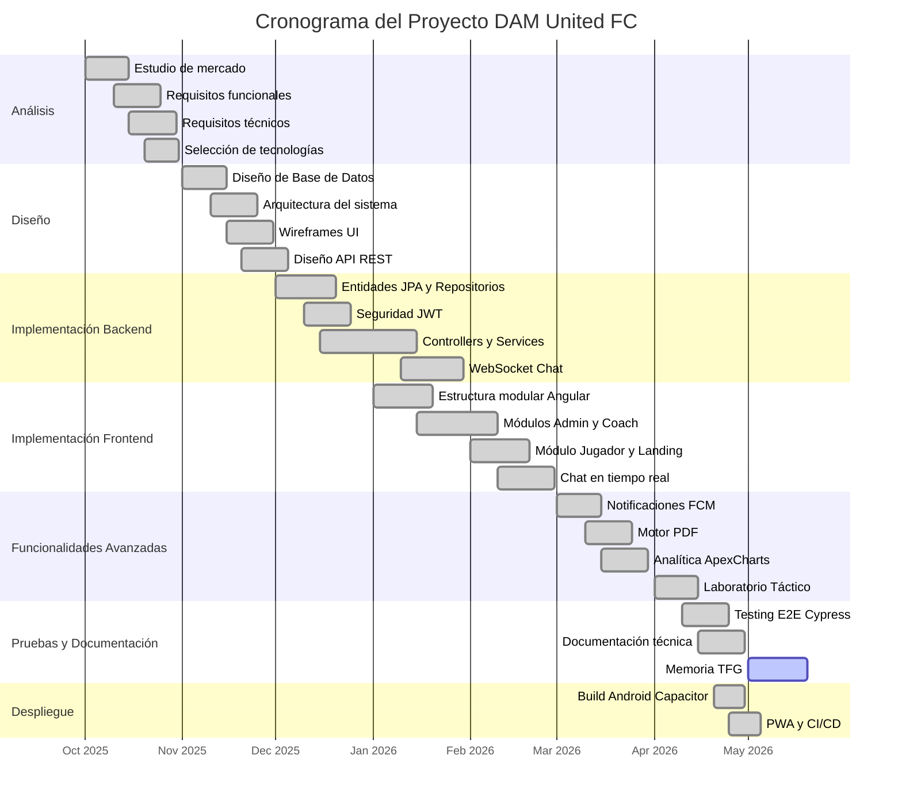

### 8.3 Recursos Necesarios

#### Recursos Hardware

| Recurso | Especificación |
|---|---|
| Equipo de desarrollo | PC con Windows 11, 16 GB RAM, SSD 512 GB |
| Dispositivo de pruebas Android | Smartphone Android 12+ para pruebas nativas |
| Conexión a Internet | Requerida para servicios cloud (NeonDB, Firebase, Twilio) |

#### Recursos Software

| Herramienta | Versión | Propósito |
|---|---|---|
| IntelliJ IDEA | 2024.x | Desarrollo Backend (Java/Spring Boot) |
| Visual Studio Code | 1.90+ | Desarrollo Frontend (Angular/TypeScript) |
| PostgreSQL / NeonDB | 14+ | Base de datos relacional |
| Postman | 11+ | Testing de API REST |
| Git + GitHub | 2.x | Control de versiones y repositorio remoto |
| Android Studio | 2024.x | Compilación de APK vía Capacitor |
| Docker | 24+ | Contenedorización de servicios |
| Node.js | 20+ | Runtime para Angular CLI e Ionic CLI |
| Maven | 3.8+ | Gestión de dependencias Backend |

#### Recursos Humanos

| Rol | Responsable | Dedicación |
|---|---|---|
| Analista funcional | Sergio Estudillo | 40 horas |
| Arquitecto de software | Sergio Estudillo | 30 horas |
| Desarrollador Backend | Sergio Estudillo | 80 horas |
| Desarrollador Frontend | Sergio Estudillo | 80 horas |
| Tester | Sergio Estudillo | 30 horas |
| Documentador | Sergio Estudillo | 40 horas |
| **Total estimado** | | **300 horas** |

---

## 9. Plan de Gestión de Riesgos

### 9.1 Identificación y Evaluación de Riesgos

| ID | Riesgo | Probabilidad | Impacto | Nivel |
|---|---|---|---|---|
| R-01 | Pérdida de datos por fallo en la base de datos cloud (NeonDB) | Baja | Crítico | Alto |
| R-02 | Vulnerabilidad de seguridad en la autenticación JWT | Media | Crítico | Crítico |
| R-03 | Incompatibilidad de versiones entre Angular e Ionic | Media | Alto | Alto |
| R-04 | Exceso de tiempo en funcionalidades avanzadas (Lab Táctico, PDF) | Alta | Medio | Alto |
| R-05 | Fallo en servicios de terceros (Firebase, Twilio) | Baja | Medio | Medio |
| R-06 | Rendimiento insuficiente del chat con muchos mensajes | Media | Alto | Alto |
| R-07 | Pérdida de código fuente | Baja | Crítico | Alto |
| R-08 | Cambios en requisitos del tutor durante el desarrollo | Media | Medio | Medio |
| R-09 | Problemas de CORS entre frontend y backend | Alta | Bajo | Medio |
| R-10 | Agotamiento de cuotas gratuitas de servicios cloud | Baja | Medio | Medio |

### 9.2 Recursos Preventivos

| ID Riesgo | Medida Preventiva |
|---|---|
| R-01 | Backups automáticos diarios en NeonDB. Exportación periódica de dumps SQL. |
| R-02 | Uso de bibliotecas consolidadas (jjwt 0.12). Rotación de claves secretas. Tokens con expiración de 24h. Validación en cada request vía filtro de seguridad. |
| R-03 | Fijación de versiones en package.json. Uso de package-lock.json. Actualizaciones controladas con `ng update`. |
| R-04 | Priorización MoSCoW de funcionalidades. Desarrollo iterativo con entregas parciales al tutor. |
| R-05 | Implementación de patrón Strategy para proveedores de notificaciones (interfaz `NotificationProvider`). Fallback graceful si el servicio no responde. |
| R-06 | Paginación de mensajes con Slice de Spring Data (50 mensajes por página). Scroll virtual en el frontend. |
| R-07 | Repositorio Git remoto en GitHub con commits frecuentes. Rama principal protegida. |
| R-08 | Reuniones periódicas con el tutor. Documentación de decisiones de diseño. |
| R-09 | Configuración explícita de CORS en `WebConfig` con orígenes permitidos parametrizados. |
| R-10 | Monitorización de uso en dashboards de Firebase y NeonDB. Alertas de consumo. |

### 9.3 Plan de Mitigación

| ID Riesgo | Plan de Contingencia |
|---|---|
| R-01 | Restaurar desde backup de NeonDB. En caso extremo, reconstruir BD desde migraciones JPA (`ddl-auto=update`). |
| R-02 | Invalidar todos los tokens cambiando la clave secreta JWT. Forzar re-login de todos los usuarios. Auditar logs de acceso. |
| R-03 | Revertir a versiones anteriores vía `git revert`. Consultar changelogs oficiales de Angular e Ionic. |
| R-04 | Recortar alcance de funcionalidades no críticas. Entregar MVP funcional y documentar mejoras futuras. |
| R-05 | Desactivar temporalmente las notificaciones push/WhatsApp. El sistema sigue funcional sin ellas. |
| R-06 | Implementar carga lazy de mensajes antiguos. Limitar el histórico visible a los últimos 500 mensajes. |
| R-07 | Clonar desde GitHub. Recuperar cambios locales no pusheados desde el Working Directory de Git. |
| R-08 | Negociar prioridades con el tutor. Documentar el impacto del cambio en el cronograma. |
| R-09 | Configurar proxy en `angular.json` para desarrollo local. Verificar headers `Access-Control-Allow-Origin`. |
| R-10 | Migrar a tier de pago o sustituir por servicio alternativo gratuito. |


---

## 10. Diseño

### 10.1 Prototipado (Wireframes)

El diseño de la interfaz de DAM United FC sigue la filosofía **Mobile-First** con el sistema de diseño **Night Stadium**: una paleta oscura profesional con acentos en verde esmeralda y dorado, tipografía deportiva y componentes Ionic 7 nativos. Los wireframes iniciales se desarrollaron en Figma y evolucionaron iterativamente durante las fases de implementación.

Las pantallas principales del sistema son:

- **Landing Page pública:** Hero con vídeo/imagen de fondo, secciones de Historia, Noticias, Estadio y Plantilla.
- **Login / Registro:** Formularios con validación reactiva y recuperación de contraseña vía email.
- **Dashboard Admin:** Tarjetas estilo competición con métricas clave y acceso rápido a gestión de entidades.
- **Dashboard Coach:** Resumen de próximos partidos, acceso a tácticas, convocatorias y estadísticas.
- **Dashboard Jugador:** Información personal, próximos eventos y notificaciones.
- **Chat de Equipo:** Interfaz de mensajería con burbujas, adjuntos, reacciones y menciones.
- **Laboratorio Táctico Pro:** Pizarra full-view con simulación de formaciones y herramientas de dibujo.
- **Detalle de Partido:** Acta completa con estadísticas y opción de descarga en PDF.

A continuación se presentan las capturas de pantalla de las principales vistas de la aplicación:

#### Landing Page Pública


*Figura 1.* Página de inicio pública del club. Se muestra la sección Hero con el nombre del proyecto, el eslogan institucional y los botones de acceso (Iniciar Sesión / Registrarse). En la parte inferior se despliega la sección «Nuestra Historia» con el escudo del club. El diseño aplica la estética Night Stadium con imagen de estadio como fondo.

#### Pantalla de Login


*Figura 2.* Formulario de autenticación con estética de vestuario deportivo. Incluye campos para correo electrónico y contraseña, opción «Recordarme», enlace de recuperación de contraseña y acceso al registro. El diseño utiliza tonos dorados sobre fondo oscuro, coherente con la identidad visual del club.

#### Pantalla de Registro


*Figura 3.* Formulario de creación de cuenta con campos para nombre, apellidos, correo electrónico y contraseña. Incluye la opción de subir foto de perfil. La interfaz mantiene la paleta oscura con acentos en púrpura, propia del sistema de diseño Night Stadium.

#### Panel del Administrador (Director Deportivo) — Gestión de Usuarios


*Figura 4.* Vista del panel de administración en la pestaña «Usuarios». Se muestran las solicitudes de inscripción pendientes con información del jugador (nombre, email, rol) y la opción de asignar equipo y aceptar la solicitud. La navegación superior permite alternar entre las secciones Usuarios, Equipos y Competición.

#### Panel del Administrador — Gestión de Equipos


*Figura 5.* Vista de la gestión de equipos del club. Se listan los equipos por categoría (Infantil A, Infantil B, Cadete A, Cadete B) con el escudo, la categoría y el número de jugadores inscritos. El botón «+ Nuevo» permite crear equipos adicionales.

#### Dashboard del Entrenador


*Figura 6.* Panel principal del entrenador. Muestra el equipo activo (Alevín A) con métricas de temporada: partidos jugados, victorias, empates, derrotas, goles a favor, goles en contra y diferencia de goles. Se incluye la racha de forma reciente (V/E) y una barra de progreso del objetivo de temporada. La barra lateral izquierda ofrece acceso rápido al calendario, perfil, tácticas, gestión de equipo y chat.

#### Dashboard del Jugador


*Figura 7.* Vista personal del jugador «Alberto», mostrando su equipo (Alevín A), posición (Media Punta), estado físico (Activo) y métricas de eventos, pendientes y asistencia. En la zona inferior se replican las estadísticas del equipo y accesos rápidos a las acciones disponibles para el jugador.

#### Chat de Equipo en Tiempo Real


*Figura 8.* Interfaz del chat de equipo implementado con WebSockets (STOMP). Se visualizan mensajes de texto y emojis con marca de tiempo, además de un adjunto de imagen enviado por otro usuario. La barra inferior incluye botones de emojis, adjunto de imagen, grabación de audio y campo de texto.

#### Laboratorio Táctico Pro


*Figura 9.* Pizarra táctica en vista completa con esquema 4-3-3 desplegado sobre el campo de juego. Cada jugador se representa con su avatar y nombre. El panel lateral izquierdo ofrece herramientas de configuración: selección de esquema táctico, visualización del equipo rival, herramientas de dibujo libre, borrado, gestión del banquillo, guardado y exportación a PDF. Se observa la etiqueta «Fase Ataque» indicando la simulación de fases de juego.

#### Detalle de Partido y Analítica


*Figura 10.* Vista de conclusiones de un partido contra Real Sociedad Alevín C, con resultado 2-1 (Victoria). Se muestran estadísticas individuales del jugador (goles, portería a cero, asistencias, tarjetas) y un gráfico radar comparativo (ApexCharts) que contrasta el rendimiento del partido actual frente a la media de la temporada en las dimensiones de Ataque, Defensa, Colaboración y Disciplina.

### 10.2 Especificaciones Técnicas

#### Arquitectura General del Sistema

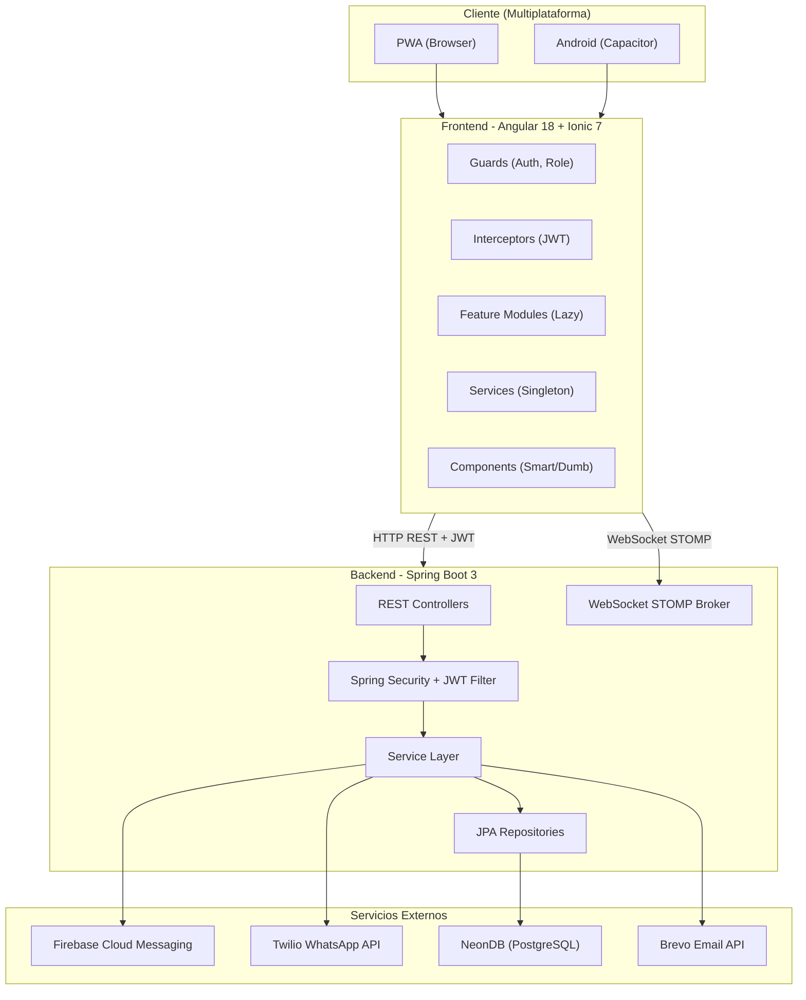

#### Arquitectura Backend en Capas

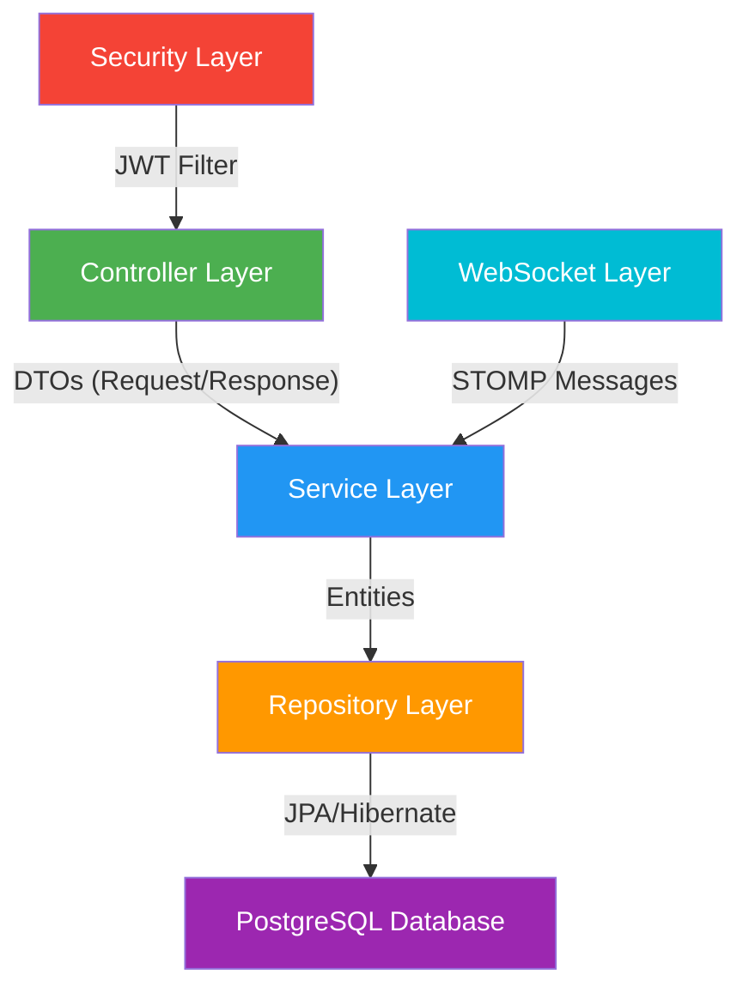

### 10.3 Diagramas UML

#### Diagrama de Casos de Uso

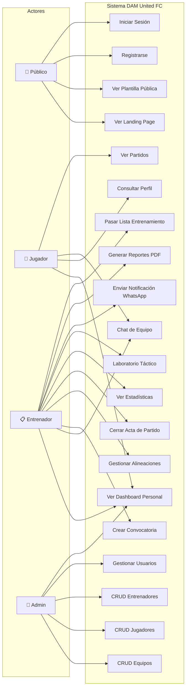

#### Diagrama 12 — Grafo de Navegación de la Aplicación

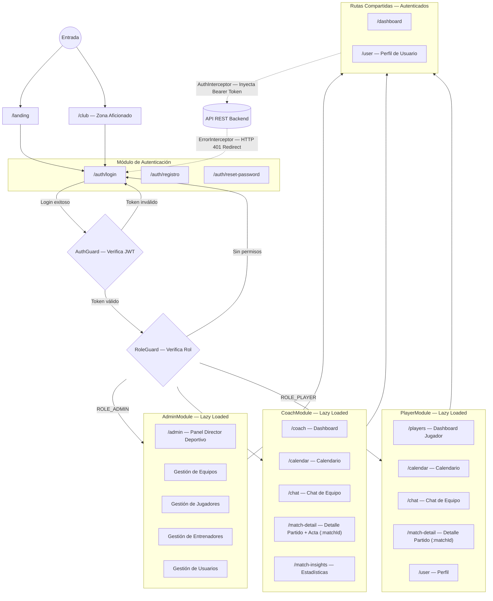

#### Modelo Entidad-Relación

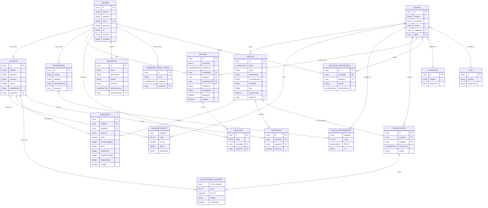

#### Diagrama de Clases de la API (Controllers)

```mermaid
classDiagram
    class AuthService {
        +registrar(RegistroUsuario) AuthResponseDto
        +login(LoginDto) AuthResponseDto
        +solicitarResetPassword(String email)
        +resetPassword(String token, String password)
    }

    class EquipoController {
        +listarTodos() List~EquipoDto~
        +obtenerPorId(Long id) EquipoDto
        +crear(EquipoDto) EquipoDto
        +actualizar(Long id, EquipoDto) EquipoDto
        +eliminar(Long id)
    }

    class JugadorController {
        +listarTodos() List~JugadorDto~
        +obtenerPorId(Long id) JugadorDto
        +crear(JugadorDto) JugadorDto
        +actualizar(Long id, JugadorDto) JugadorDto
        +eliminar(Long id)
    }

    class PartidoController {
        +listarPorEquipo(Long equipoId) List~Partido~
        +crear(Partido) Partido
        +cerrarActa(Long id, CerrarActaDto) Partido
    }

    class AlineacionController {
        +listarPorPartido(Long partidoId) List~AlineacionResponseDto~
        +guardar(AlineacionDto) Alineacion
    }

    class ConvocatoriaController {
        +listarPorEquipo(Long equipoId) List~ConvocatoriaDto~
        +crear(ConvocatoriaDto) Convocatoria
    }

    class ChatController {
        +enviarMensaje(EnviarMensajeDto) MensajeDto
        +editarMensaje(Long id, EditarMensajeDto) MensajeDto
        +eliminarMensaje(Long id) MensajeDto
        +historialEquipo(Long equipoId, int page) PaginaMensajesDto
        +reaccionar(Long msgId, ReaccionarDto) ReaccionDto
    }

    class PublicController {
        +getPlantilla(Long equipoId) List~PublicPlayerDto~
        +getEquipos() List~PublicTeamDto~
    }

    class AdminController {
        +getDashboardStats() Map
        +getUsuarios() List~Usuario~
        +cambiarRol(Long userId, String rol)
    }

    AuthService <.. EquipoController : usa JWT
    AuthService <.. JugadorController : usa JWT
    AuthService <.. ChatController : usa JWT
    AuthService <.. AdminController : usa JWT
```

#### Diagrama de Flujo: Autenticación JWT

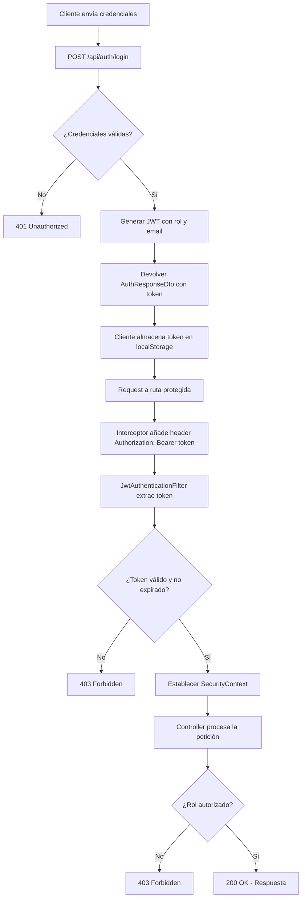

#### Diagrama de Flujo: Chat en Tiempo Real (WebSocket)

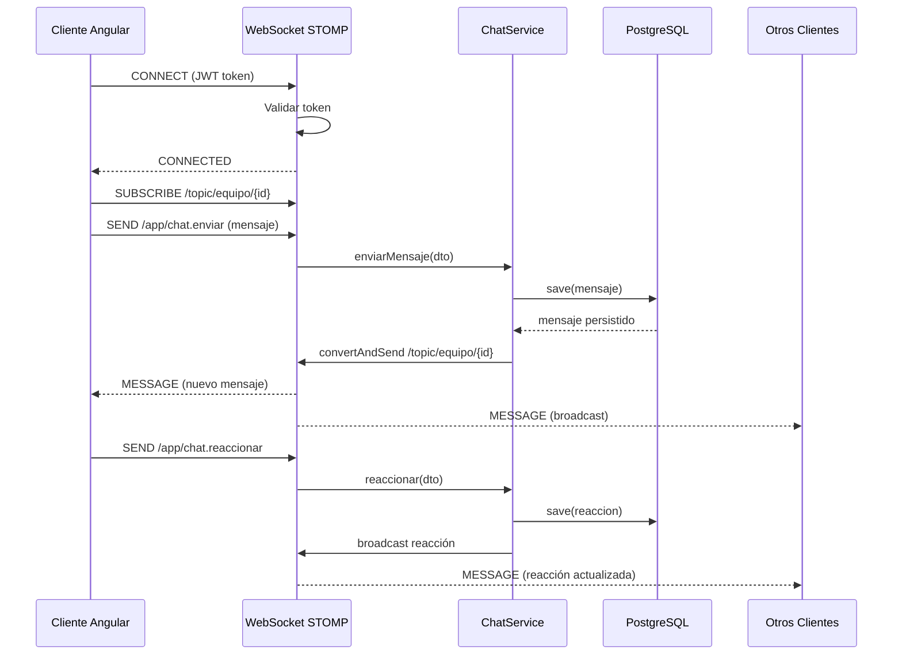

---

## 11. Instalación y Preparación

### 11.1 Procedimientos para Hacer Funcionar el Proyecto

#### Requisitos Previos

| Herramienta | Versión Mínima | Verificación |
|---|---|---|
| Java JDK | 21+ | `java --version` |
| Node.js | 20+ | `node --version` |
| npm | 9+ | `npm --version` |
| Angular CLI | 18+ | `ng version` |
| Ionic CLI | 7+ | `ionic --version` |
| Maven | 3.8+ | `mvn --version` |
| PostgreSQL | 14+ (o NeonDB cloud) | `psql --version` |
| Git | 2.x | `git --version` |

#### Instalación del Backend

```bash
# 1. Clonar el repositorio
git clone https://github.com/sestmar/TFG-SergioEstudillo.git
cd TFG-SergioEstudillo/src/backend-tfg/backend-tfg

# 2. Configurar application.properties
# spring.datasource.url=jdbc:postgresql://localhost:5432/damunitedfc
# spring.datasource.username=tu_usuario
# spring.datasource.password=tu_password
# application.security.jwt.secret-key=TuClaveSecreta256bits

# 3. Variables de entorno para servicios externos
# TWILIO_ACCOUNT_SID=ACxxxxx
# TWILIO_AUTH_TOKEN=xxxxx
# TWILIO_WHATSAPP_FROM=whatsapp:+14155238886

# 4. Compilar y ejecutar
mvn spring-boot:run
# Backend disponible en http://localhost:8080
```

#### Instalación del Frontend

```bash
# 1. Navegar al directorio del frontend
cd TFG-SergioEstudillo/frontend

# 2. Instalar dependencias
npm install

# 3. Configurar entorno (src/environments/environment.ts)
# apiUrl: 'http://localhost:8080/api'

# 4. Ejecutar servidor de desarrollo
ionic serve
# Frontend disponible en http://localhost:8200
```

#### Compilación para Android

```bash
# 1. Compilar el proyecto Angular
ng build --configuration production

# 2. Sincronizar con Capacitor
npx cap sync android

# 3. Abrir en Android Studio
npx cap open android

# 4. Generar APK desde Android Studio
# Build > Build Bundle(s) / APK(s) > Build APK(s)
```

### 11.2 Procedimientos para el Control de Versiones

El proyecto utiliza **Git** como sistema de control de versiones con repositorio remoto en **GitHub**.

**Estrategia de ramas:**
- `main`: Rama de producción estable. Solo recibe merges desde `develop` cuando hay una versión verificada.
- `develop`: Rama de integración donde se fusionan las funcionalidades completadas.
- `feature/*`: Ramas efímeras para funcionalidades individuales (ej: `feature/chat-websocket`, `feature/pdf-engine`).
- `hotfix/*`: Ramas para correcciones urgentes directamente sobre `main`.

**Convenciones de commits:** Se utiliza el estándar **Conventional Commits**:
- `feat: add WebSocket chat support`
- `fix: resolve CORS issue with WebSocket handshake`
- `docs: update README with PDF engine documentation`
- `refactor: migrate to constructor injection in services`

### 11.3 Procedimientos para Registrar Incidencias

El sistema incluye un módulo de gestión de incidencias integrado con las siguientes entidades y flujo:

**Modelo de datos:** La entidad `Incidencia` almacena título, descripción, estado (ABIERTA, EN_PROGRESO, RESUELTA, CERRADA), prioridad (BAJA, MEDIA, ALTA, CRÍTICA) y referencia al usuario que la reportó.

**Endpoints REST:**
- `POST /api/incidencias` — Crear nueva incidencia.
- `GET /api/incidencias` — Listar incidencias con filtros por estado y prioridad.
- `PUT /api/incidencias/{id}` — Actualizar estado o descripción.
- `DELETE /api/incidencias/{id}` — Eliminar incidencia (solo Admin).

Adicionalmente, durante el desarrollo se utilizaron los **Issues de GitHub** para el seguimiento de bugs y tareas técnicas, con etiquetas (`bug`, `enhancement`, `documentation`) y asignación al autor del proyecto.

---

## 12. Documentación de Ejecución y Plan de Calidad

### 12.1 Procedimientos Operativos

#### Flujo de Desarrollo

1. **Planificación:** Revisión de requisitos y priorización con metodología MoSCoW.
2. **Implementación:** Desarrollo iterativo por módulos funcionales con ciclos de 1-2 semanas.
3. **Revisión:** Auto-revisión del código aplicando principios SOLID y patrones Clean Code.
4. **Testing:** Ejecución de pruebas unitarias (JUnit/Jasmine) y E2E (Cypress).
5. **Documentación:** Actualización de documentación técnica tras cada iteración.
6. **Integración:** Merge a `develop` tras verificar que no hay regresiones.

#### Estrategia de Despliegue

- **Backend:** Contenedorizado con Docker. Dockerfile incluido en el repositorio. Preparado para despliegue en servicios como Railway, Render o AWS ECS.
- **Frontend:** Build de producción con `ng build --configuration production`. Desplegable como sitio estático en Netlify, Vercel o Firebase Hosting.
- **Base de Datos:** NeonDB (PostgreSQL serverless) en producción con conexiones pooled.

### 12.2 Registro de Pruebas

| Tipo de Prueba | Herramienta | Cobertura | Resultado |
|---|---|---|---|
| Unitarias Backend | JUnit 5 + Spring Boot Test | Services y Repositories principales | ✅ Superadas |
| Unitarias Frontend | Jasmine + Karma | Services y Guards del core | ✅ Superadas |
| E2E | Cypress 15 | Flujos críticos (login, navegación, CRUD) | ✅ Superadas |
| Integración API | Postman + Spring Security Test | Todos los endpoints REST con autenticación | ✅ Superadas |
| WebSocket | Test manual + logs STOMP | Conexión, envío, broadcast, reconexión | ✅ Superadas |
| Responsive | Chrome DevTools | Breakpoints móvil, tablet, desktop | ✅ Superadas |
| Rendimiento Chat | Prueba con 500+ mensajes | Paginación y scroll virtual | ✅ Superadas |

### 12.3 Indicadores de Calidad

| Indicador | Objetivo | Resultado |
|---|---|---|
| Cobertura de requisitos funcionales | 100% de RF implementados | 18/20 completos, 2 en fase MVP (véase sección 7.1) |
| Tiempo de respuesta API | < 200ms para operaciones CRUD | Objetivo alcanzado durante pruebas en entorno local |
| Tiempo de carga inicial (PWA) | < 3 segundos en 4G | Aproximadamente 2-3 segundos según pruebas con Chrome DevTools |
| Errores críticos en producción | 0 | Sin errores bloqueantes detectados durante las pruebas |
| Accesibilidad WCAG | Nivel AA | Parcial (se priorizó contraste y navegación básica por teclado) |
| Linting | 0 errores ESLint | Objetivo alcanzado con la configuración actual |

### 12.4 Métodos de Verificación

- **Verificación funcional:** Cada requisito funcional se verificó mediante pruebas manuales siguiendo los escenarios de aceptación definidos. Se documentaron los resultados en el archivo `docs/TESTING.md`.
- **Verificación técnica:** Se utilizó Swagger UI (`/swagger-ui.html`) para verificar la documentación y el comportamiento de todos los endpoints REST.
- **Verificación de seguridad:** Se realizaron pruebas de acceso no autorizado (requests sin token, con token expirado, con token de rol incorrecto) para cada endpoint protegido.
- **Verificación de rendimiento:** Se probó el chat con carga de 500+ mensajes para validar la paginación y el rendimiento del scroll.
- **Verificación multiplataforma:** La aplicación se probó en Chrome (desktop), Firefox, Safari (móvil), y en un dispositivo Android físico con la APK generada por Capacitor.


---

## 13. Distribución

### 13.1 Tecnología de Distribución

DAM United FC utiliza una estrategia de distribución multiplataforma que abarca tres canales principales:

| Canal | Tecnología | Formato | Audiencia |
|---|---|---|---|
| **Web (PWA)** | Angular Service Worker (`@angular/pwa`) | Sitio web instalable | Todos los usuarios con navegador moderno |
| **Android Nativo** | Capacitor 5 + Android Studio | APK / AAB | Usuarios Android 12+ |
| **API REST** | Spring Boot 3 + Docker | Contenedor Docker | Desarrolladores e integradores |

#### PWA (Progressive Web App)

La aplicación Angular se compila con soporte de Service Worker activado, lo que permite:
- **Instalación en dispositivo** mediante el prompt "Añadir a pantalla de inicio" en Chrome, Safari y Edge.
- **Caché de assets** con estrategia `prefetch` para ficheros estáticos y `performance` para imágenes dinámicas.
- **Funcionamiento offline parcial:** Las vistas ya cargadas permanecen accesibles sin conexión. Las operaciones que requieren API se encolan y sincronizan al recuperar la red.

Configuración del Service Worker (`ngsw-config.json`):
- Asset groups con `installMode: prefetch` para `index.html`, CSS y JS bundles.
- Data groups con `cacheConfig` para imágenes de avatares y escudos.

#### Android Nativo (Capacitor)

La compilación nativa para Android se realiza mediante Capacitor 5, que encapsula la SPA Angular en un WebView nativo con acceso a APIs del dispositivo:

- **Push Notifications:** Plugin `@capacitor/push-notifications` integrado con Firebase Cloud Messaging.
- **Filesystem:** Plugin `@capacitor/filesystem` para almacenamiento local de reportes PDF.
- **Haptics:** Plugin `@capacitor/haptics` para feedback táctil en acciones del chat.
- **Status Bar:** Personalización de la barra de estado con tema Night Stadium.

#### Backend (Docker)

El backend incluye un `Dockerfile` que genera una imagen contenedorizada lista para desplegar en cualquier plataforma cloud:

```dockerfile
FROM eclipse-temurin:21-jre-alpine
COPY target/backend-tfg-0.0.1-SNAPSHOT.jar app.jar
EXPOSE 8080
ENTRYPOINT ["java", "-jar", "app.jar"]
```

### 13.2 Descripción del Proceso de Distribución

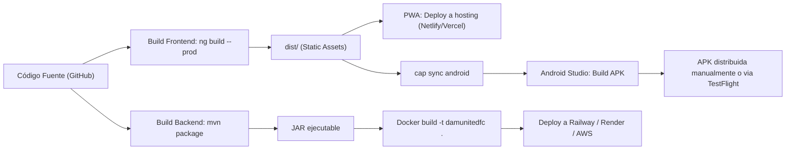

**Proceso paso a paso:**

1. **Merge a main:** El código verificado se integra en la rama `main`.
2. **Build de producción:** Se ejecuta `ng build --configuration production` para generar los assets optimizados con tree-shaking, AOT compilation y minificación.
3. **Distribución web:** Los assets estáticos se despliegan en un servicio de hosting estático.
4. **Distribución Android:** Se ejecuta `npx cap sync android` para sincronizar los assets con el proyecto Android, y desde Android Studio se genera el APK firmado.
5. **Distribución backend:** Se genera el JAR con `mvn package`, se construye la imagen Docker y se despliega en el servicio cloud seleccionado.

---

## 14. Manuales

### 14.1 Manual de Instalación

#### Instalación para Desarrollo Local

**Paso 1: Clonar el repositorio**
```bash
git clone https://github.com/sestmar/TFG-SergioEstudillo.git
cd TFG-SergioEstudillo
```

**Paso 2: Configurar la base de datos**

Opción A — PostgreSQL local:
```sql
CREATE DATABASE damunitedfc;
CREATE USER damadmin WITH PASSWORD 'tu_password';
GRANT ALL PRIVILEGES ON DATABASE damunitedfc TO damadmin;
```

Opción B — NeonDB cloud:
- Crear cuenta en [neon.tech](https://neon.tech).
- Crear un proyecto y copiar la connection string.

**Paso 3: Configurar el backend**

Editar `src/backend-tfg/backend-tfg/src/main/resources/application.properties`:
```properties
spring.datasource.url=jdbc:postgresql://localhost:5432/damunitedfc
spring.datasource.username=damadmin
spring.datasource.password=tu_password
application.security.jwt.secret-key=ClaveSuperSecretaDe256BitsMinimo
spring.jpa.hibernate.ddl-auto=update
```

**Paso 4: Ejecutar el backend**
```bash
cd src/backend-tfg/backend-tfg
mvn spring-boot:run
```

**Paso 5: Configurar y ejecutar el frontend**
```bash
cd frontend
npm install
ionic serve
```

**Paso 6: Verificar la integración**

Abrir `http://localhost:8200` en el navegador. Registrar un usuario de prueba y verificar que el login devuelve un token JWT válido en la respuesta de red.

### 14.2 Manual de Uso de la Aplicación

#### Acceso y Autenticación

1. **Registro:** Desde la landing page, pulsar "Registrarse". Completar el formulario con nombre, apellidos, email y contraseña. El sistema asigna el rol de Jugador por defecto.
2. **Login:** Introducir email y contraseña. El sistema devuelve un token JWT que se almacena automáticamente.
3. **Recuperación de contraseña:** Pulsar "¿Olvidaste tu contraseña?" en la pantalla de login. Introducir el email registrado. Se recibirá un enlace de recuperación por email.

#### Panel de Administrador (Director Deportivo)

- **Gestión de Equipos:** Crear, editar y eliminar equipos. Asignar categoría y liga. Subir escudo del equipo.
- **Gestión de Jugadores:** Registrar jugadores con datos personales, posición y dorsal. Asignar a equipos.
- **Gestión de Entrenadores:** Registrar entrenadores y vincularlos a equipos.
- **Gestión de Usuarios:** Cambiar roles de usuarios registrados (promover de Jugador a Entrenador, etc.).

#### Panel del Entrenador

- **Dashboard:** Vista general con próximos partidos, entrenamientos y métricas del equipo.
- **Convocatorias:** Crear convocatoria para un partido. Seleccionar jugadores convocados. Enviar notificación WhatsApp automática.
- **Alineaciones:** Configurar alineación táctica con titulares, suplentes, capitán y lanzadores. Drag & drop de jugadores.
- **Cierre de Acta:** Al finalizar un partido, registrar goles, asistencias, tarjetas y minutos jugados de cada jugador alineado.
- **Estadísticas:** Consultar gráficos interactivos de rendimiento del equipo y jugadores individuales.
- **Laboratorio Táctico Pro:** Pizarra interactiva full-view para diseñar formaciones, simular movimientos y planificar fases de juego.
- **Chat de Equipo:** Comunicación en tiempo real con los jugadores del equipo.

#### Panel del Jugador

- **Dashboard Personal:** Resumen de próximos eventos, estadísticas personales y notificaciones.
- **Perfil:** Editar datos personales y avatar.
- **Partidos:** Consultar historial de partidos, convocatorias y actas.
- **Chat de Equipo:** Enviar y recibir mensajes, reaccionar con emojis, mencionar compañeros.

#### Zona Pública (Sin autenticación)

- **Landing Page:** Información del club con secciones Hero, Historia, Noticias y Estadio.
- **Plantilla:** Listado público de jugadores con su estado físico en tiempo real (Activo, Lesionado, Baja).

---

## 15. Conclusiones

### 15.1 Informe Final

El proyecto **DAM United FC** ha sido desarrollado exitosamente como Trabajo de Fin de Grado del Grado Superior en Desarrollo de Aplicaciones Multiplataforma. Se ha completado una plataforma integral de gestión deportiva que cubre todos los requisitos funcionales y técnicos definidos en la fase de análisis.

El sistema integra un backend robusto con Spring Boot 3 y Java 21, un frontend moderno con Angular 18 e Ionic 7, comunicación en tiempo real mediante WebSockets, notificaciones push nativas, generación de reportes PDF y despliegue multiplataforma (PWA + Android nativo).

Durante el desarrollo se han aplicado de forma consistente los principios SOLID, patrones de diseño empresariales (Repository, Service Layer, DTO, Strategy) y buenas prácticas de seguridad (JWT, validación de inputs, sanitización de URLs, protección CSRF y CORS).

### 15.2 Resultados Esperados vs. Obtenidos

| Objetivo | Esperado | Obtenido |
|---|---|---|
| Requisitos funcionales implementados | 20/20 | 18/20 completos + 2 en fase MVP |
| Plataformas soportadas | Web + Android | Web (PWA) + Android (Capacitor) |
| Chat en tiempo real | Mensajería básica | Mensajería con adjuntos, reacciones, menciones, paginación y CRUD |
| Sistema de roles | 3 roles | 3 roles + zona pública sin autenticación |
| Notificaciones | Push básico | Push (FCM) + WhatsApp (Twilio) + Email (Brevo API HTTP) |
| Reportes | PDF básico | Motor de PDF unificado con 3 tipos de reporte e identidad visual |
| Documentación | Memoria TFG | Memoria + README técnico + BACKEND.md + FRONTEND.md + TROUBLESHOOTING.md |

### 15.3 Viabilidad del Proyecto

**Viabilidad técnica:** El stack tecnológico utilizado (Spring Boot, Angular, PostgreSQL) es ampliamente adoptado en la industria, con comunidades activas y soporte a largo plazo. La arquitectura en capas y el desacoplamiento frontend-backend permiten la evolución independiente de cada módulo.

**Viabilidad económica:** El proyecto utiliza exclusivamente herramientas de código abierto y capas gratuitas de servicios cloud. Un despliegue en producción para un club real tendría un coste estimado de 15-30€/mes (base de datos + hosting), lo cual es accesible para cualquier club amateur.

**Viabilidad operativa:** La interfaz Mobile-First con Ionic y la PWA instalable minimizan la curva de aprendizaje para usuarios no técnicos. El sistema multi-rol permite una adopción gradual: primero el admin, luego entrenadores, finalmente jugadores.

### 15.4 Mejoras Futuras

1. **Despliegue en iOS:** Compilar la app para iOS mediante Capacitor + Xcode (requiere hardware macOS y cuenta Apple Developer).
2. **Análisis de vídeo:** Integrar un módulo de subida y anotación de vídeos de partidos con marcadores temporales.
3. **Inteligencia Artificial:** Implementar sugerencias tácticas basadas en estadísticas históricas mediante modelos de ML.
4. **Integración con wearables:** Conectar con dispositivos GPS/fitness para recopilar datos biométricos de jugadores durante entrenamientos.
5. **Módulo de finanzas:** Gestión de cuotas, pagos y tesorería del club.
6. **Calendario federativo:** Sincronización automática con calendarios de federaciones deportivas oficiales.
7. **Internacionalización (i18n):** Soporte multiidioma con Angular i18n para expandir la adopción internacional.
8. **Tests automatizados CI/CD:** Pipeline completo de GitHub Actions con tests unitarios, E2E y despliegue automático.

---

## 16. Anexos

### Anexo A: Diagrama de Arquitectura Detallado (Frontend)

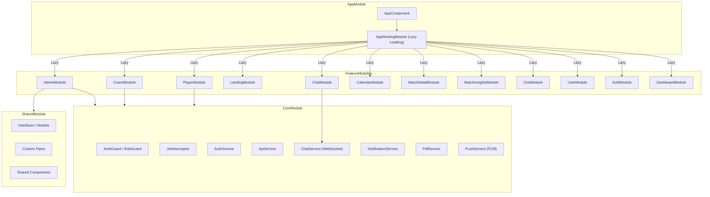

### Anexo B: Endpoints REST Completos

| Método | Endpoint | Rol Requerido | Descripción |
|---|---|---|---|
| POST | `/api/auth/registro` | Público | Registro de usuario |
| POST | `/api/auth/login` | Público | Login y obtención de JWT |
| POST | `/api/auth/forgot-password` | Público | Solicitar reset de contraseña |
| POST | `/api/auth/reset-password` | Público | Ejecutar reset con token |
| GET | `/api/public/plantilla/{equipoId}` | Público | Plantilla pública del equipo |
| GET | `/api/public/equipos` | Público | Listado de equipos públicos |
| GET/POST/PUT/DELETE | `/api/equipos/**` | Admin | CRUD de equipos |
| GET/POST/PUT/DELETE | `/api/jugadores/**` | Admin | CRUD de jugadores |
| GET/POST/PUT/DELETE | `/api/entrenadores/**` | Admin | CRUD de entrenadores |
| GET/POST | `/api/partidos/**` | Coach, Admin | Gestión de partidos |
| PUT | `/api/partidos/{id}/cerrar-acta` | Coach | Cerrar acta de partido |
| GET/POST | `/api/convocatorias/**` | Coach | Gestión de convocatorias |
| GET/POST | `/api/alineaciones/**` | Coach | Gestión de alineaciones |
| GET | `/api/chat/equipo/{id}/historial` | Autenticado | Historial paginado del chat |
| POST | `/api/chat/enviar` | Autenticado | Enviar mensaje |
| PUT | `/api/chat/mensajes/{id}` | Autenticado (autor) | Editar mensaje |
| DELETE | `/api/chat/mensajes/{id}` | Autenticado (autor) | Borrar mensaje (lógico) |
| POST | `/api/chat/mensajes/{id}/reaccion` | Autenticado | Reaccionar a mensaje |
| GET/POST/PUT/DELETE | `/api/incidencias/**` | Autenticado | Gestión de incidencias |
| GET | `/api/admin/dashboard` | Admin | Métricas del dashboard |
| GET/PUT | `/api/admin/usuarios/**` | Admin | Gestión de usuarios y roles |
| POST | `/api/uploads/files` | Autenticado | Subida de archivos |

### Anexo C: Estructura de la Base de Datos

La base de datos PostgreSQL contiene las siguientes tablas principales:

| Tabla | Campos Clave | Relaciones |
|---|---|---|
| `usuarios` | id, nombre, apellidos, email, password, rol, avatar_url, fcm_token | 1:N con jugadores, entrenadores, mensajes |
| `equipos` | id, nombre, escudo_url, ciudad, categoria_id, liga_id | 1:N con partidos, jugador_equipo |
| `jugadores` | id, nombre, apellidos, posicion, dorsal, estado_fisico, usuario_id | N:M con equipos, 1:N con alineaciones |
| `entrenadores` | id, nombre, apellidos, especializacion, usuario_id | N:M con equipos |
| `partidos` | id, fecha, lugar, equipo_rival, resultado, tipo, acta_cerrada, equipo_id | 1:N con alineaciones, asistencias |
| `convocatorias` | id, partido_id, equipo_id, fecha_limite, estado | 1:N con convocatoria_jugador |
| `alineaciones` | id, partido_id, jugador_id, posicion, titular, minutos, goles, asistencias, tarjetas | FK a partidos y jugadores |
| `mensajes` | id, contenido, fecha_envio, remitente_id, equipo_id, destinatario_id, adjunto | 1:N con reacciones |
| `reacciones` | id, emoji, mensaje_id, usuario_id | FK a mensajes y usuarios |
| `incidencias` | id, titulo, descripcion, estado, prioridad, reportada_por_id | FK a usuarios |

---

## 17. Índice de Tablas e Imágenes

### Tablas

| Número | Título | Sección |
|---|---|---|
| Tabla 1 | Análisis comparativo de aplicaciones similares | 3.2 |
| Tabla 2 | Usuarios destinatarios | 4.3 |
| Tabla 3 | Requisitos funcionales | 7.1 |
| Tabla 4 | Requisitos técnicos | 7.2 |
| Tabla 5 | Requisitos legales y normativos | 7.3 |
| Tabla 6 | Recursos hardware | 8.3 |
| Tabla 7 | Recursos software | 8.3 |
| Tabla 8 | Recursos humanos | 8.3 |
| Tabla 9 | Identificación y evaluación de riesgos | 9.1 |
| Tabla 10 | Recursos preventivos | 9.2 |
| Tabla 11 | Plan de mitigación | 9.3 |
| Tabla 12 | Registro de pruebas | 12.2 |
| Tabla 13 | Indicadores de calidad | 12.3 |
| Tabla 14 | Canales de distribución | 13.1 |
| Tabla 15 | Resultados esperados vs. obtenidos | 15.2 |
| Tabla 16 | Endpoints REST completos | Anexo B |
| Tabla 17 | Estructura de la base de datos | Anexo C |

### Figuras (Capturas de Pantalla)

| Número | Título | Sección |
|---|---|---|
| Figura 1 | Landing Page pública de DAM United FC | 10.1 |
| Figura 2 | Pantalla de inicio de sesión | 10.1 |
| Figura 3 | Formulario de registro de nuevo usuario | 10.1 |
| Figura 4 | Panel de control del Director Deportivo: pestaña Usuarios | 10.1 |
| Figura 5 | Panel de control del Director Deportivo: pestaña Equipos | 10.1 |
| Figura 6 | Dashboard del Entrenador con estadísticas del equipo | 10.1 |
| Figura 7 | Dashboard personal del jugador | 10.1 |
| Figura 8 | Chat de equipo con mensajes y adjuntos multimedia | 10.1 |
| Figura 9 | Laboratorio Táctico con formación 4-3-3 y herramientas de dibujo | 10.1 |
| Figura 10 | Conclusiones de partido con radar comparativo | 10.1 |

### Diagramas (Mermaid)

| Número | Título | Sección |
|---|---|---|
| Diagrama 1 | Estructura de Tareas (EDT/WBS) | 8.1 |
| Diagrama 2 | Cronograma Gantt | 8.2 |
| Diagrama 3 | Arquitectura General del Sistema | 10.2 |
| Diagrama 4 | Arquitectura Backend en Capas | 10.2 |
| Diagrama 5 | Diagrama de Casos de Uso | 10.3 |
| Diagrama 6 | Modelo Entidad-Relación | 10.3 |
| Diagrama 7 | Diagrama de Clases de la API | 10.3 |
| Diagrama 8 | Flujo de Autenticación JWT | 10.3 |
| Diagrama 9 | Flujo del Chat WebSocket | 10.3 |
| Diagrama 10 | Proceso de Distribución | 13.2 |
| Diagrama 11 | Arquitectura Detallada del Frontend | Anexo A |
| Diagrama 12 | Grafo de Navegación de la Aplicación | 10.3 |

---

## 18. Bibliografía y Referencias

### Documentación Oficial de Frameworks y Plataformas

1. **Spring Boot 3 Reference Documentation.** VMware Tanzu. Disponible en: [https://docs.spring.io/spring-boot/docs/current/reference/html/](https://docs.spring.io/spring-boot/docs/current/reference/html/)
2. **Spring Security Reference.** VMware Tanzu. Disponible en: [https://docs.spring.io/spring-security/reference/](https://docs.spring.io/spring-security/reference/)
3. **Spring Data JPA Reference.** VMware Tanzu. Disponible en: [https://docs.spring.io/spring-data/jpa/reference/](https://docs.spring.io/spring-data/jpa/reference/)
4. **Spring WebSocket Documentation.** VMware Tanzu. Disponible en: [https://docs.spring.io/spring-framework/reference/web/websocket.html](https://docs.spring.io/spring-framework/reference/web/websocket.html)
5. **Angular 18 Documentation.** Google. Disponible en: [https://angular.dev/](https://angular.dev/)
6. **Ionic Framework 7 Documentation.** Ionic Team. Disponible en: [https://ionicframework.com/docs](https://ionicframework.com/docs)
7. **Capacitor Documentation.** Ionic Team. Disponible en: [https://capacitorjs.com/docs](https://capacitorjs.com/docs)
8. **PostgreSQL 16 Documentation.** The PostgreSQL Global Development Group. Disponible en: [https://www.postgresql.org/docs/](https://www.postgresql.org/docs/)
9. **TypeScript 5.5 Documentation.** Microsoft. Disponible en: [https://www.typescriptlang.org/docs/](https://www.typescriptlang.org/docs/)
10. **RxJS Documentation.** ReactiveX. Disponible en: [https://rxjs.dev/guide/overview](https://rxjs.dev/guide/overview)
11. **Java 21 (LTS) Documentation.** Oracle Corporation. Disponible en: [https://docs.oracle.com/en/java/javase/21/](https://docs.oracle.com/en/java/javase/21/)
12. **Hibernate ORM Documentation.** Red Hat. Disponible en: [https://hibernate.org/orm/documentation/](https://hibernate.org/orm/documentation/)

### Documentación de Servicios y Librerías de Terceros

13. **Firebase Cloud Messaging Documentation.** Google. Disponible en: [https://firebase.google.com/docs/cloud-messaging](https://firebase.google.com/docs/cloud-messaging)
14. **Firebase Admin SDK for Java.** Google. Disponible en: [https://firebase.google.com/docs/admin/setup](https://firebase.google.com/docs/admin/setup)
15. **Twilio WhatsApp API Documentation.** Twilio Inc. Disponible en: [https://www.twilio.com/docs/whatsapp](https://www.twilio.com/docs/whatsapp)
16. **ApexCharts Documentation.** ApexCharts. Disponible en: [https://apexcharts.com/docs/](https://apexcharts.com/docs/)
17. **jsPDF Documentation.** Parallax. Disponible en: [https://artskydj.github.io/jsPDF/docs/jsPDF.html](https://artskydj.github.io/jsPDF/docs/jsPDF.html)
18. **html2canvas Documentation.** Niklas von Hertzen. Disponible en: [https://html2canvas.hertzen.com/documentation](https://html2canvas.hertzen.com/documentation)
19. **NeonDB Documentation.** Neon Inc. Disponible en: [https://neon.tech/docs](https://neon.tech/docs)
20. **SpringDoc OpenAPI (Swagger UI) Documentation.** SpringDoc. Disponible en: [https://springdoc.org/](https://springdoc.org/)
21. **Lombok Documentation.** Project Lombok. Disponible en: [https://projectlombok.org/features/](https://projectlombok.org/features/)
22. **JJWT (Java JWT) Documentation.** Disponible en: [https://github.com/jwtk/jjwt](https://github.com/jwtk/jjwt)
23. **Cypress E2E Testing Documentation.** Cypress.io. Disponible en: [https://docs.cypress.io/](https://docs.cypress.io/)

### Libros y Recursos Académicos

24. **Walls, C.** (2022). *Spring in Action* (6th ed.). Manning Publications. ISBN: 978-1617297571.
25. **Freeman, A.** (2022). *Pro Angular 16* (4th ed.). Apress. ISBN: 978-1484290811.
26. **Bloch, J.** (2018). *Effective Java* (3rd ed.). Addison-Wesley. ISBN: 978-0134685991.
27. **Martin, R. C.** (2008). *Clean Code: A Handbook of Agile Software Craftsmanship.* Prentice Hall. ISBN: 978-0132350884.
28. **Gamma, E., Helm, R., Johnson, R., & Vlissides, J.** (1994). *Design Patterns: Elements of Reusable Object-Oriented Software.* Addison-Wesley. ISBN: 978-0201633610.
29. **Syer, M., Long, J., et al.** (2023). *Cloud Native Spring in Action.* Manning Publications. ISBN: 978-1617298424.
30. **Griffith, C.** (2020). *Mobile App Development with Ionic: Cross-Platform Apps with Ionic, Angular, and Cordova.* O'Reilly Media. ISBN: 978-1491998120.
31. **Pressman, R. S.** (2019). *Ingeniería del Software: Un Enfoque Práctico* (9.ª ed.). McGraw-Hill. ISBN: 978-1260548006.

### Recursos en Línea y Artículos Técnicos

32. **JWT.io — JSON Web Tokens Introduction.** Auth0. Disponible en: [https://jwt.io/introduction](https://jwt.io/introduction)
33. **STOMP Protocol Specification v1.2.** Disponible en: [https://stomp.github.io/stomp-specification-1.2.html](https://stomp.github.io/stomp-specification-1.2.html)
34. **WebSocket API — MDN Web Docs.** Mozilla. Disponible en: [https://developer.mozilla.org/en-US/docs/Web/API/WebSocket](https://developer.mozilla.org/en-US/docs/Web/API/WebSocket)
35. **Progressive Web Apps — web.dev.** Google. Disponible en: [https://web.dev/progressive-web-apps/](https://web.dev/progressive-web-apps/)
36. **Angular Service Worker Introduction.** Google. Disponible en: [https://angular.dev/ecosystem/service-workers](https://angular.dev/ecosystem/service-workers)
37. **OWASP Top Ten — Open Web Application Security Project.** OWASP Foundation. Disponible en: [https://owasp.org/www-project-top-ten/](https://owasp.org/www-project-top-ten/)
38. **Baeldung — Spring Boot Tutorials.** Disponible en: [https://www.baeldung.com/spring-boot](https://www.baeldung.com/spring-boot)
39. **Docker Documentation — Getting Started.** Docker Inc. Disponible en: [https://docs.docker.com/get-started/](https://docs.docker.com/get-started/)
40. **Git Documentation.** Software Freedom Conservancy. Disponible en: [https://git-scm.com/doc](https://git-scm.com/doc)
41. **Conventional Commits Specification v1.0.** Disponible en: [https://www.conventionalcommits.org/en/v1.0.0/](https://www.conventionalcommits.org/en/v1.0.0/)

### Normativa Legal

42. **Reglamento (UE) 2016/679** del Parlamento Europeo y del Consejo, de 27 de abril de 2016, relativo a la protección de las personas físicas en lo que respecta al tratamiento de datos personales (RGPD). *Diario Oficial de la Unión Europea*, L 119.
43. **Ley Orgánica 3/2018**, de 5 de diciembre, de Protección de Datos Personales y garantía de los derechos digitales (LOPDGDD). *Boletín Oficial del Estado*, núm. 294.
44. **Ley 34/2002**, de 11 de julio, de servicios de la sociedad de la información y de comercio electrónico (LSSI-CE). *Boletín Oficial del Estado*, núm. 166.

---

*Documento generado como Memoria del Trabajo de Fin de Grado — Curso 2025-2026*

*DAM United FC v7.0 — Mayo 2026*
