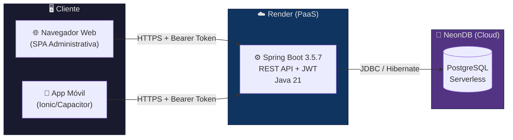
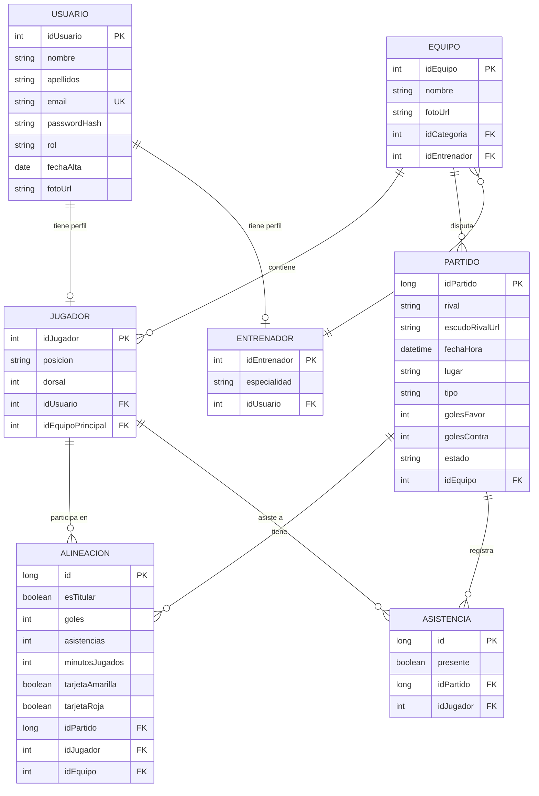
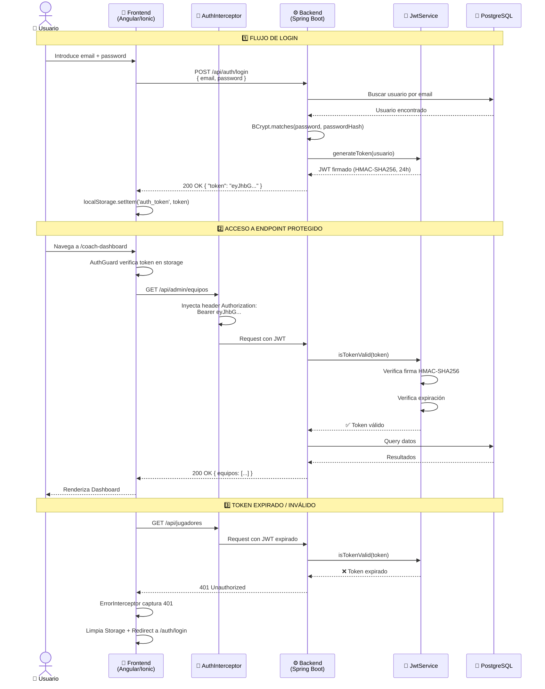

<](https://spring.io/projects/spring-boot)
[](https://angular.io/)
[](https://ionicframework.com/)
[](https://neon.tech/)
[](https://render.com/)
[](https://openjdk.org/)
[](#licencia)

**Plataforma Cloud & Mobile First para la digitalización completa de clubes de fútbol base.**

[📘 Backend](./BACKEND.md) · [📗 Frontend](./FRONTEND.md) · [🔧 Troubleshooting](./TROUBLESHOOTING.md)

</div>

---

## 📋 Índice

1. [Descripción del Proyecto](#-descripción-del-proyecto)
2. [Arquitectura de Despliegue](#-arquitectura-de-despliegue)
3. [Stack Tecnológico](#-stack-tecnológico)
4. [Modelo de Datos (ER)](#-modelo-de-datos)
5. [Seguridad y Flujo JWT](#-seguridad-y-flujo-jwt)
6. [Matriz de Control de Acceso (ACL)](#-matriz-de-control-de-acceso)
7. [Características Principales](#-características-principales)
8. [Estructura del Repositorio](#-estructura-del-repositorio)
9. [Guía de Ejecución Local](#-guía-de-ejecución-local)
10. [Documentación Extendida](#-documentación-extendida)
11. [Autor](#-autor)

---

## 🎯 Descripción del Proyecto

**DAM United FC** es una plataforma Full Stack diseñada para la **digitalización integral de clubes de fútbol base**. Permite gestionar usuarios, equipos, jugadores, entrenadores, partidos, entrenamientos, alineaciones, convocatorias, asistencia e incidencias desde una interfaz unificada, adaptada a tres perfiles de usuario: **Director Deportivo (Admin)**, **Entrenador** y **Jugador**.

### Highlights Técnicos

- 🔐 **Autenticación JWT Stateless** con Spring Security 6 y firma HMAC-SHA256.
- 📊 **Estadísticas dinámicas** calculadas en tiempo real mediante Java Streams sobre la entidad `Alineacion` (patrón DTO).
- ☁️ **Infraestructura Cloud**: Base de datos PostgreSQL en **NeonDB**, Backend en **Render**.
- 📱 **Mobile First**: Interfaz híbrida construida con Angular 16 + Ionic 7.
- 🧩 **Arquitectura modular**: 10 módulos Lazy-Loaded, 18+ servicios Singleton, Guards y HTTP Interceptors.

---

## ☁️ Arquitectura de Despliegue



> **Nota sobre PaaS gratuito:** Al usar el tier gratuito de Render, el sistema de archivos es **efímero** — cada redeploy borra archivos locales. Esto motivó un [sistema híbrido de gestión de imágenes](./TROUBLESHOOTING.md#1-sistemas-de-archivos-efímeros-en-paas-render) documentado en Troubleshooting.

---

## 🛠️ Stack Tecnológico

| Capa | Tecnología | Versión | Propósito |
|------|-----------|---------|-----------|
| **Backend** | Spring Boot | 3.5.7 | Framework REST + IoC |
| **Lenguaje** | Java | 21 | Lenguaje servidor |
| **Seguridad** | Spring Security 6 | 6.x | Autenticación y autorización |
| **Tokens** | JJWT | 0.12.3 | Generación/validación JWT |
| **ORM** | Hibernate/JPA | - | Mapeo objeto-relacional |
| **Base de datos** | PostgreSQL | - | Persistencia (NeonDB Cloud) |
| **Frontend** | Angular | 16+ | SPA Framework |
| **Mobile** | Ionic | 7 | UI Híbrida + Capacitor |
| **Reactivo** | RxJS | 7.8+ | Programación reactiva |
| **Infraestructura** | Render | - | PaaS Backend hosting |
| **Build Backend** | Maven | - | Gestión de dependencias |
| **Build Frontend** | Angular CLI + npm | - | Build y dev server |

---

## 🗄️ Modelo de Datos

### Diagrama Entidad-Relación (Simplificado)



### Lógica de Estadísticas Dinámicas (Patrón DTO)

Las estadísticas de un jugador **no se almacenan de forma estática** en la entidad `Jugador`. En su lugar, el `PublicController` las **calcula dinámicamente** a partir de los registros de `Alineacion` usando Java Streams:

```java
// PublicController.java — Cálculo en tiempo real
List<Alineacion> participaciones = alineacionRepo.findByJugador(j);

int totalGoles = participaciones.stream()
    .mapToInt(a -> a.getGoles() != null ? a.getGoles() : 0).sum();
int totalAsist = participaciones.stream()
    .mapToInt(a -> a.getAsistencias() != null ? a.getAsistencias() : 0).sum();

// Se devuelve un PublicPlayerDto optimizado (sin datos sensibles)
dto.setGoles(totalGoles);
dto.setAsistencias(totalAsist);
```

> **Ventaja:** Fuente única de verdad (`Alineacion`), sin inconsistencias por datos duplicados.

---

## 🔐 Seguridad y Flujo JWT

El sistema es completamente **Stateless**. No se mantienen sesiones en el servidor; toda la autenticación se basa en tokens JWT firmados.

### Sequence Diagram — Flujo de Login y Acceso Protegido



### Componentes de Seguridad

| Componente | Capa | Responsabilidad |
|-----------|------|----------------|
| `SecurityConfig` | Backend | Configuración de cadena de filtros, rutas públicas/privadas, CORS |
| `JwtAuthenticationFilter` | Backend | Intercepta requests, extrae y valida token JWT |
| `JwtService` | Backend | Genera y valida tokens (HMAC-SHA256, expiración 24h) |
| `AuthService` | Backend | Lógica de registro/login, hash BCrypt |
| `@JsonIgnore` | Backend | Excluye `passwordHash`, `getAuthorities()`, `getPassword()` de la serialización |
| `AuthInterceptor` | Frontend | Inyecta `Authorization: Bearer <token>` en cada petición HTTP |
| `AuthGuard` | Frontend | Protege rutas que requieren autenticación |
| `RoleGuard` | Frontend | Protege rutas por rol específico |
| `ErrorInterceptor` | Frontend | Captura 401: logout automático + redirect |

---

## 🛡️ Matriz de Control de Acceso

| Recurso / Acción | `ADMIN` | `ENTRENADOR` | `JUGADOR` | Público |
|------------------|:-------:|:------------:|:---------:|:-------:|
| Login / Registro | ✅ | ✅ | ✅ | ✅ |
| Ver equipos públicos | ✅ | ✅ | ✅ | ✅ |
| Ver plantilla pública | ✅ | ✅ | ✅ | ✅ |
| Dashboard Admin | ✅ | ❌ | ❌ | ❌ |
| CRUD Usuarios | ✅ | ❌ | ❌ | ❌ |
| Crear Equipos / Partidos | ✅ | ❌ | ❌ | ❌ |
| Asignar Jugadores/Entrenadores | ✅ | ❌ | ❌ | ❌ |
| Cerrar Actas | ✅ | ❌ | ❌ | ❌ |
| Dashboard Entrenador | ✅ | ✅ | ❌ | ❌ |
| Gestionar Alineaciones | ✅ | ✅ | ❌ | ❌ |
| Crear Convocatorias | ✅ | ✅ | ❌ | ❌ |
| Ver Estadísticas Equipo | ✅ | ✅ | ❌ | ❌ |
| Dashboard Jugador | ❌ | ❌ | ✅ | ❌ |
| Ver perfil propio | ✅ | ✅ | ✅ | ❌ |

---

## ✨ Características Principales

### 🏟️ Gestión Deportiva
- CRUD completo de **equipos, jugadores y entrenadores**.
- Creación de **partidos y entrenamientos** con escudo rival (URL o archivo).
- **Alineaciones tácticas** con titulares/suplentes, sustituciones, capitán y lanzadores.
- **Cierre de actas** con goles, asistencias, tarjetas y minutos jugados.
- **Pasar lista** de asistencia a entrenamientos.

### 📊 Estadísticas & Datos
- Estadísticas de jugador calculadas dinámicamente desde `Alineacion`.
- Vista pública de plantilla y equipos sin autenticación (`/api/public/**`).
- Detalle de partidos con acta completa.

### 👥 Multi-Rol
- **Admin (Director Deportivo):** Panel completo de gestión.
- **Entrenador:** Dashboard, pizarra táctica, convocatorias, estadísticas.
- **Jugador:** Dashboard personal, partidos, perfil.

### 📱 Mobile First
- Interfaz Ionic 7 adaptativa para **web y móvil**.
- Componentes nativos (IonHeader, IonCard, IonList, IonFab).
- Capacitor para despliegue en Android.

---

## 📁 Estructura del Repositorio

```
TFG-SergioEstudillo/
├── src/backend-tfg/backend-tfg/     # ⚙️ Spring Boot Backend
│   ├── src/main/java/.../
│   │   ├── config/                  # SecurityConfig, CorsConfig, WebConfig
│   │   ├── controller/              # 19 REST Controllers
│   │   ├── dto/                     # 19 Data Transfer Objects
│   │   ├── model/                   # 18 Entidades JPA
│   │   ├── repository/              # JpaRepository interfaces
│   │   ├── security/                # JwtAuthenticationFilter
│   │   └── service/                 # JwtService, AuthService
│   ├── src/main/resources/
│   │   └── application.properties
│   └── pom.xml
│
├── frontend/                        # 📱 Angular 16 + Ionic 7
│   ├── src/app/
│   │   ├── core/                    # Guards, Interceptors, 18+ Services
│   │   ├── modules/                 # 10 Feature Modules (Lazy Loaded)
│   │   │   ├── admin/               # Panel Director Deportivo
│   │   │   ├── auth/                # Login / Registro
│   │   │   ├── coach/               # Dashboard + Tácticas + Convocatorias
│   │   │   ├── players/             # Dashboard Jugador
│   │   │   ├── landing/             # Página pública
│   │   │   ├── club/                # Vista Club
│   │   │   ├── calendar/            # Calendario de eventos
│   │   │   ├── match-detail/        # Detalle de partido
│   │   │   ├── dashboard/           # Dashboard genérico
│   │   │   └── user/                # Perfil de usuario
│   │   └── shared/                  # Componentes y modelos compartidos
│   ├── src/environments/            # Configuración por entorno
│   └── package.json
│
├── docs/                            # 📖 Documentación adicional
├── README.md                        # ← Este archivo
├── BACKEND.md                       # Documentación técnica Backend
├── FRONTEND.md                      # Documentación técnica Frontend
└── TROUBLESHOOTING.md               # Guía de resolución de problemas
```

---

## 🚀 Guía de Ejecución Local

### Requisitos Previos

| Herramienta | Versión Mínima |
|------------|---------------|
| Java JDK | 21+ |
| Node.js | 18+ |
| npm | 9+ |
| Angular CLI | 16+ |
| Ionic CLI | 7+ |
| Maven | 3.8+ |
| PostgreSQL | 14+ (o usar NeonDB) |
| Git | 2.x |

### 1. Clonar el Repositorio

```bash
git clone https://github.com/sestmar/TFG-SergioEstudillo.git
cd TFG-SergioEstudillo
```

### 2. Backend (Spring Boot)

```bash
cd src/backend-tfg/backend-tfg

# Configurar application.properties con tu BD local o NeonDB:
# spring.datasource.url=jdbc:postgresql://localhost:5432/damunitedfc
# spring.datasource.username=tu_usuario
# spring.datasource.password=tu_password
# application.security.jwt.secret-key=TuClaveSecreta256bits

# Compilar y ejecutar
mvn spring-boot:run
```

> Backend disponible en `http://localhost:8080`

### 3. Frontend (Angular/Ionic)

```bash
cd frontend

# Instalar dependencias
npm install

# Editar src/environments/environment.ts para apuntar al backend local:
# apiUrl: 'http://localhost:8080/api'

# Ejecutar servidor de desarrollo
ionic serve
# ó
ng serve
```

> Frontend disponible en `http://localhost:8200`

### 4. Verificar Integración

1. Abre `http://localhost:8200` → Landing Page visible.
2. Regístrate con un nuevo usuario.
3. Inicia sesión → Verifica token JWT en `Network → Response`.
4. Navega a una ruta protegida → Verifica header `Authorization: Bearer <token>`.

---

## 📚 Documentación Extendida

| Documento | Contenido |
|-----------|-----------|
| [📘 BACKEND.md](./BACKEND.md) | Arquitectura en capas, entidades JPA, endpoints REST, configuración de seguridad, DTOs y lógica de negocio |
| [📗 FRONTEND.md](./FRONTEND.md) | Arquitectura modular, Lazy Loading, servicios Singleton, Guards, Interceptors, patrón Smart-Dumb components, integración RxJS |
| [🔧 TROUBLESHOOTING.md](./TROUBLESHOOTING.md) | 5 casos reales de bugs críticos resueltos durante el desarrollo, con análisis de causa raíz y solución |

---

## 👤 Autor

**Sergio Estudillo**
Estudiante de 2º DAM — Desarrollo de Aplicaciones Multiplataforma

[](https://github.com/sestmar)

---

## 📄 Licencia

Este proyecto es un **Trabajo Final de Grado (TFG)** desarrollado con fines educativos.

---

<div align="center">

*Documentación actualizada: Marzo 2026*
*Versión: 4.0 — Cloud & Mobile First*

</div>
]]>
