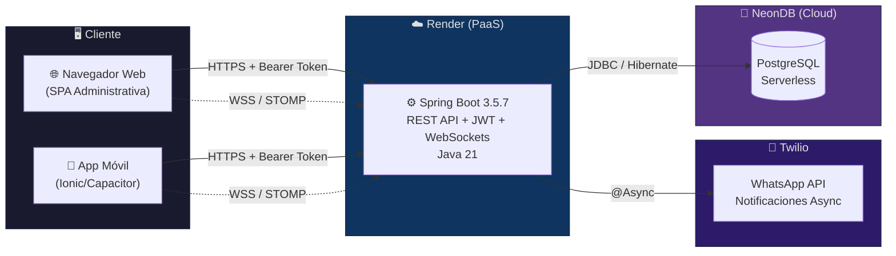
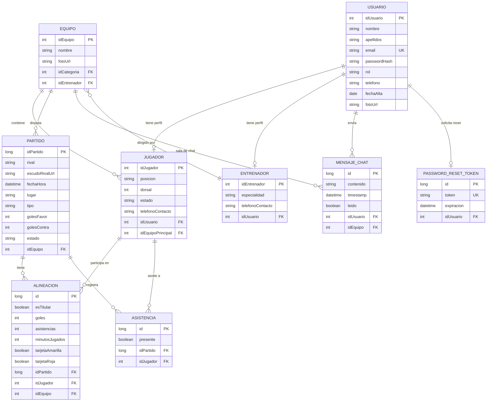
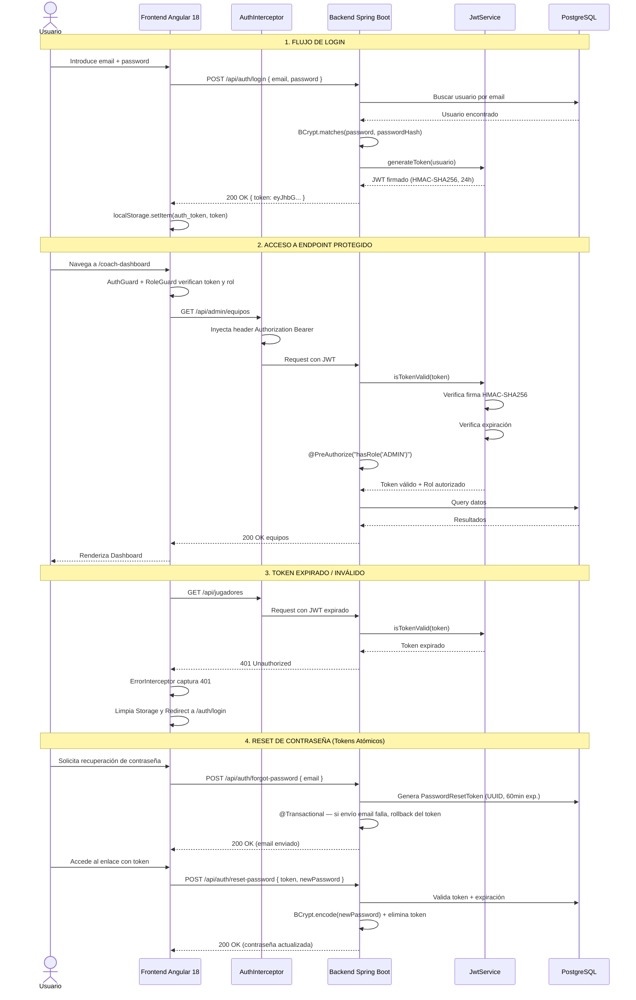
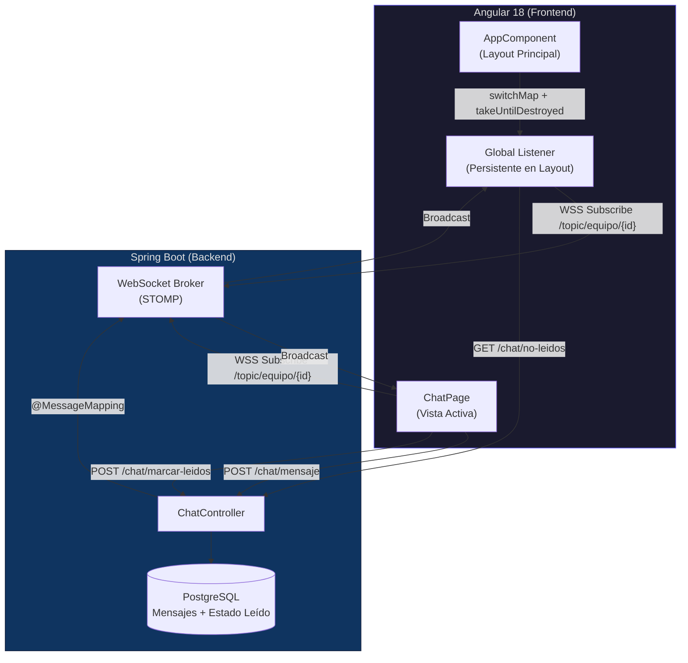

<div align="center">

# DAM United FC — Gestión Integral de Clubes Deportivos

### Trabajo Final de Grado · Desarrollo de Aplicaciones Multiplataforma

[](https://github.com/Sestmar/TFG-SergioEstudillo/actions/workflows/backend-ci.yml)
[](https://github.com/Sestmar/TFG-SergioEstudillo/actions/workflows/frontend-ci.yml)

[](https://spring.io/projects/spring-boot)
[](https://angular.dev/)
[](https://ionicframework.com/)
[](https://neon.tech/)
[](https://render.com/)
[](https://openjdk.org/)
[](#licencia)

**Plataforma Cloud & Mobile First para la digitalización completa de clubes de fútbol base.**

[📘 Backend](./BACKEND.md) · [📗 Frontend](./FRONTEND.md) · [🔧 Troubleshooting](./TROUBLESHOOTING.md)

</div>

---

## 📋 Índice

1. [Descripción del Proyecto](#-descripción-del-proyecto)
2. [Arquitectura de Despliegue](#-arquitectura-de-despliegue)
3. [Stack Tecnológico](#-stack-tecnológico)
4. [Modelo de Datos (ER)](#-modelo-de-datos)
5. [Seguridad y Flujo JWT](#-seguridad-y-flujo-jwt)
6. [Matriz de Control de Acceso (ACL)](#-matriz-de-control-de-acceso)
7. [Mensajería en Tiempo Real](#-mensajería-en-tiempo-real)
8. [Ingeniería de Notificaciones](#-ingeniería-de-notificaciones)
9. [Visualización de Datos](#-visualización-de-datos)
10. [Experiencia Night Stadium](#-experiencia-night-stadium)
11. [Características Principales](#-características-principales)
12. [Estructura del Repositorio](#-estructura-del-repositorio)
13. [Guía de Ejecución Local](#-guía-de-ejecución-local)
14. [Documentación Extendida](#-documentación-extendida)
15. [Autor](#-autor)

---

## 🎯 Descripción del Proyecto

**DAM United FC** es una plataforma Full Stack diseñada para la **digitalización integral de clubes de fútbol base**. Permite gestionar usuarios, equipos, jugadores, entrenadores, partidos, entrenamientos, alineaciones, convocatorias, asistencia, incidencias y **chat en tiempo real** desde una interfaz unificada, adaptada a tres perfiles de usuario: **Director Deportivo (Admin)**, **Entrenador** y **Jugador**.

El proyecto ha evolucionado desde un prototipo funcional hacia una **plataforma SaaS robusta, segura y escalable**, sometida a auditorías de seguridad (Fase 1 y 2) y optimización de rendimiento.

### Highlights Técnicos

- 🔐 **Autenticación JWT Stateless** con Spring Security 6, firma HMAC-SHA256 y **seguridad a nivel de método** (`@PreAuthorize`).
- ⚡ **Reactividad RxJS avanzada**: Operadores de transformación (`switchMap`, `forkJoin`), gestión automática de memoria con `TakeUntilDestroyed` y eliminación de Callback Hell.
- 📊 **Analítica deportiva con ApexCharts**: Visualización de rendimiento mediante gráficos inmutables con patrones de refresco por Spread Operator.
- ☁️ **Infraestructura Cloud**: PostgreSQL en **NeonDB**, Backend en **Render**, gestión de secretos por variables de entorno.
- 📱 **Mobile First**: Interfaz híbrida construida con **Angular 18** + Ionic 7, con identidad visual personalizada (Glassmorphism, selector `:has`, Shadow Parts).
- 💬 **Chat en Tiempo Real**: Arquitectura WebSockets + STOMP con **Doble Cliente STOMP** y sincronización de badges offline.
- 📲 **Notificaciones WhatsApp**: Integración asíncrona (`@Async`) con **Twilio** para convocatorias y recordatorios.
- 🏗️ **Backend SOLID**: Inyección por constructor (`private final` + `@RequiredArgsConstructor`), Thin Controllers y capa de servicio transaccional.
- 🧩 **Arquitectura modular**: 10+ módulos Lazy-Loaded, 18+ servicios Singleton, Guards reactivos y HTTP Interceptors.

---

## ☁️ Arquitectura de Despliegue



> **Nota sobre PaaS gratuito:** Al usar el tier gratuito de Render, el sistema de archivos es **efímero** — cada redeploy borra archivos locales. Esto motivó un [sistema híbrido de gestión de imágenes](./TROUBLESHOOTING.md#1-sistemas-de-archivos-efímeros-en-paas-render) documentado en Troubleshooting.

---

## 🛠️ Stack Tecnológico

| Capa | Tecnología | Versión | Propósito |
|------|-----------|---------|-----------|
| **Backend** | Spring Boot | 3.5.7 | Framework REST + IoC |
| **Lenguaje** | Java | 21 | Lenguaje servidor |
| **Seguridad** | Spring Security 6 | 6.x | Autenticación, autorización y `@PreAuthorize` |
| **Tokens** | JJWT | 0.12.3 | Generación/validación JWT (HMAC-SHA256) |
| **ORM** | Hibernate/JPA | - | Mapeo objeto-relacional |
| **Base de datos** | PostgreSQL | - | Persistencia (NeonDB Cloud) |
| **WebSockets** | Spring WebSocket + STOMP | - | Mensajería bidireccional en tiempo real |
| **Notificaciones** | Twilio (WhatsApp API) | - | Alertas de convocatorias y partidos vía WhatsApp |
| **Frontend** | Angular | 18 | SPA Framework |
| **Mobile** | Ionic | 7 | UI Híbrida + Capacitor |
| **Reactivo** | RxJS | 7.8+ | Programación reactiva (`switchMap`, `forkJoin`, `TakeUntilDestroyed`) |
| **Gráficos** | ApexCharts + ng-apexcharts | 3.53+ / 1.12+ | Visualización de analítica deportiva |
| **Infraestructura** | Render | - | PaaS Backend hosting |
| **Build Backend** | Maven | - | Gestión de dependencias |
| **Build Frontend** | Angular CLI + npm | - | Build y dev server |

---

## 🗄️ Modelo de Datos

### Diagrama Entidad-Relación (Simplificado)



### Atomicidad Transaccional en Sincronización de Perfiles

La arquitectura del modelo de datos mantiene datos de contacto en dos capas: la tabla `Usuario` (identidad) y las tablas de rol (`Jugador`/`Entrenador`). Para garantizar la coherencia, se implementó un mecanismo de **sincronización atómica**:

1. **Persistencia del perfil de rol** (operación principal).
2. **Sincronización con la tabla `Usuario`** (operación secundaria Best-Effort con `@Async`).

Esto asegura que el sistema de notificaciones WhatsApp (Twilio) siempre consulte datos de contacto actualizados, evitando el envío de alertas a números obsoletos.

### Lógica de Estadísticas Dinámicas (Patrón DTO)

Las estadísticas de un jugador **no se almacenan de forma estática** en la entidad `Jugador`. En su lugar, el `PublicController` las **calcula dinámicamente** a partir de los registros de `Alineacion` usando Java Streams:

```java
// PublicController.java — Cálculo en tiempo real
List<Alineacion> participaciones = alineacionRepo.findByJugador(j);

int totalGoles = participaciones.stream()
    .mapToInt(a -> a.getGoles() != null ? a.getGoles() : 0).sum();
int totalAsist = participaciones.stream()
    .mapToInt(a -> a.getAsistencias() != null ? a.getAsistencias() : 0).sum();

// Se devuelve un PublicPlayerDto optimizado (sin datos sensibles)
dto.setGoles(totalGoles);
dto.setAsistencias(totalAsist);
```

> **Ventaja:** Fuente única de verdad (`Alineacion`), sin inconsistencias por datos duplicados.

---

## 🔐 Seguridad y Flujo JWT

El sistema es completamente **Stateless**. No se mantienen sesiones en el servidor; toda la autenticación se basa en tokens JWT firmados. La seguridad ha sido endurecida en **dos fases de auditoría** que cubren desde la gestión de secretos hasta la protección contra ataques comunes.

### Sequence Diagram — Flujo de Login, Acceso Protegido y Reset de Contraseña



### Componentes de Seguridad

| Componente | Capa | Responsabilidad |
|-----------|------|----------------|
| `SecurityConfig` | Backend | Cadena de filtros, rutas públicas/privadas, CORS restrictivo (whitelist), WebSocket origins |
| `JwtAuthenticationFilter` | Backend | Intercepta requests, extrae y valida token JWT |
| `JwtService` | Backend | Genera y valida tokens (HMAC-SHA256, expiración 24h) |
| `AuthService` | Backend | Lógica de registro/login, hash BCrypt, recuperación por token atómico |
| `@PreAuthorize` | Backend | Seguridad a nivel de método — granularidad por rol en cada endpoint |
| `@JsonIgnore` | Backend | Excluye `passwordHash`, `getAuthorities()`, `getPassword()` de serialización |
| `PasswordResetToken` | Backend | Entidad con UUID seguro, relación 1:1 con `Usuario`, expiración de 60 minutos |
| `FileController` (Sanitizado) | Backend | Blindaje contra **Path Traversal** — normalización de rutas y bloqueo de secuencias `..` |
| `AuthInterceptor` | Frontend | Inyecta `Authorization: Bearer <token>` en cada petición HTTP |
| `AuthGuard` | Frontend | Protege rutas que requieren autenticación |
| `RoleGuard` | Frontend | Protege rutas por rol, insensible a mayúsculas y prefijo `ROLE_` |
| `ErrorInterceptor` | Frontend | Captura 401: logout automático + redirect |

### Blindaje de Seguridad (Resumen de Fases)

| Fase | Medida | Detalle |
|------|--------|---------|
| **Fase 1** | Externalización de secretos | Variables de entorno (`System.getenv()`), rotación de JWT Secret 256-bit, claves Gmail/Twilio |
| **Fase 1** | Method-Level Security | `@EnableMethodSecurity` + `@PreAuthorize` en controllers |
| **Fase 1** | Angular 18 | Cierre de CVEs en motor de renderizado, mejora de zona de detección |
| **Fase 2** | CORS restrictivo | Whitelist de orígenes, centralización en `SecurityConfig.java`, protección de WebSocket origins |
| **Fase 2** | Path Traversal | Sanitización de rutas en `FileController.java`, bloqueo de `..` |
| **Fase 2** | Tokens Atómicos | `PasswordResetToken` con UUID, expiración 60min, `@Transactional` rollback |

---

## 🛡️ Matriz de Control de Acceso

| Recurso / Acción | `ADMIN` | `ENTRENADOR` | `JUGADOR` | Público |
|------------------|:-------:|:------------:|:---------:|:-------:|
| Login / Registro | ✅ | ✅ | ✅ | ✅ |
| Ver equipos públicos | ✅ | ✅ | ✅ | ✅ |
| Ver plantilla pública (con estado físico) | ✅ | ✅ | ✅ | ✅ |
| Landing Page (Historia, Noticias, Estadio) | ✅ | ✅ | ✅ | ✅ |
| Dashboard Admin | ✅ | ❌ | ❌ | ❌ |
| CRUD Usuarios | ✅ | ❌ | ❌ | ❌ |
| Crear Equipos / Partidos | ✅ | ❌ | ❌ | ❌ |
| Asignar Jugadores/Entrenadores | ✅ | ❌ | ❌ | ❌ |
| Cerrar Actas | ✅ | ❌ | ❌ | ❌ |
| Dashboard Entrenador | ✅ | ✅ | ❌ | ❌ |
| Gestionar Alineaciones | ✅ | ✅ | ❌ | ❌ |
| Crear Convocatorias | ✅ | ✅ | ❌ | ❌ |
| Ver Estadísticas Equipo | ✅ | ✅ | ❌ | ❌ |
| Chat de Equipo (Tiempo Real) | ✅ | ✅ | ✅ | ❌ |
| Dashboard Jugador | ❌ | ❌ | ✅ | ❌ |
| Ver perfil propio | ✅ | ✅ | ✅ | ❌ |
| Reset de contraseña | ✅ | ✅ | ✅ | ✅ |

---

## 💬 Mensajería en Tiempo Real

Infraestructura de chat bidireccional basada en **WebSockets + STOMP**, diseñada para la comunicación interna de los equipos con entrega instantánea y coherencia del estado de lectura.

### Arquitectura del Doble Cliente STOMP



### Características Principales

| Característica | Implementación |
|---------------|---------------|
| **Doble Cliente STOMP** | Cliente en la sala activa + **Global Listener** persistente en el layout para badges |
| **Sincronización Offline** | Al conectar el WebSocket global, se ejecuta `GET /chat/no-leidos` para recuperar mensajes acumulados |
| **Confirmación de Lectura** | Flujo `Suscripción → marcarLeidos() → Confirmación Backend → Reset badge local` |
| **Filtrado de Mensajes Propios** | El motor descarta incrementos de badges y alertas locales para mensajes del propio usuario |
| **Reactividad de Conexión** | Conexión global reactiva a cambios de sesión (Login/Logout) mediante `switchMap` + `takeUntilDestroyed` |
| **Trazabilidad** | Logs de ingeniería en `ChatService` para verificar IDs de equipo/usuario en el handshake |

---

## 📲 Ingeniería de Notificaciones

### WhatsApp vía Twilio

Sistema de alertas automáticas para convocatorias y recordatorios de partido, integrado de forma asíncrona para no impactar la latencia del hilo principal.

| Aspecto | Detalle |
|---------|---------|
| **Ejecución Asíncrona** | `@Async` — envío en pool de hilos secundario, respuesta inmediata al cliente |
| **Normalización E.164** | Algoritmo de formateo que asegura compatibilidad internacional (`whatsapp:+34...`) |
| **Sincronización de Contacto** | Persistencia atómica multicapa: el teléfono se sincroniza entre `Usuario` y `Jugador`/`Entrenador` |

```java
@Async // Ejecución en pool de hilos secundario
public void enviarNotificacionPartido(String telefono, String rival, String fecha) {
    String destino = "whatsapp:" + formatearNumero(telefono);
    Message.creator(
        new PhoneNumber(destino),
        new PhoneNumber(fromNumber),
        "⚽ *DAM United* - Partido confirmado contra " + rival
    ).create();
}
```

### Motor de Notificaciones Centralizado (Frontend)

Se creó un `NotificationService` con una API fluida que abstrae la configuración de Toasts y Alerts de Ionic:

| Método | Tipo | Duración |
|--------|------|----------|
| `.success(msg)` | Toast verde neón | 2500ms |
| `.error(msg)` | Toast rojo alerta | 4000ms |
| `.warning(msg)` | Toast amarillo | 3000ms |
| `.info(msg)` | Toast violeta | 2500ms |
| `.showConfirm(header, msg)` | Alert con botones | Interactivo |

Todas las notificaciones heredan automáticamente la estética **Night Stadium** mediante Shadow Parts (`::part(container)`) y clases inyectadas (`night-toast`, `night-alert`).

---

## 📊 Visualización de Datos

### Analítica Deportiva con ApexCharts

Capa de visualización de alto rendimiento que transforma estadísticas crudas de partidos en información estratégica para el cuerpo técnico.

| Aspecto | Implementación |
|---------|---------------|
| **Patrón de Inmutabilidad** | Spread Operator para forzar refresco del DOM — Angular no detecta cambios profundos en objetos complejos |
| **Mapeo Táctico** | Pipe de transformación que agrupa posiciones dinámicas en 4 categorías maestras (GK, DEF, MID, FWD) |
| **Compatibilidad Angular 18** | Versiones fijadas `ng-apexcharts@~1.12.0` + `apexcharts@^3.53.0`, resolución limpia sin `--legacy-peer-deps` |

```typescript
// Forzado de renderizado mediante inmutabilidad
actualizarGrafico(goles: number[]) {
  this.radarChartOptions = {
    ...this.radarChartOptions, // Nueva referencia de objeto
    series: [{
      name: 'Rendimiento Promedio',
      data: goles
    }],
    xaxis: {
      categories: ['Goles', 'Asistencias', 'Minutos', 'Tarjetas']
    }
  };
}
```

---

## 🌌 Experiencia Night Stadium

Identidad visual inmersiva y coherente aplicada a toda la plataforma, basada en **Dark Mode**, **Glassmorphism** y CSS moderno de cuarta generación.

### Pilares de Diseño

| Pilar | Tecnología | Aplicación |
|-------|-----------|-----------|
| **Glassmorphism** | `backdrop-filter: blur(12px)` + bordes `rgba` | Tarjetas de jugador, modales, diálogos |
| **Selectores `:has()`** | CSS Level 4 | Estilos condicionales sin `[ngClass]` — ej. acento dorado en tarjetas de portero |
| **Shadow Parts** | `::part(container)`, `cssClass` de Ionic | Inyección de estética en Toasts, Alerts y Modals nativos de Ionic |
| **Variables CSS** | `variables.scss` (tokens de diseño) | Paleta centralizada para cambios de tema globales |

### Componentes Estilizados

| Componente | Clase CSS | Efecto |
|-----------|-----------|--------|
| Modales | `.night-modal` | Fondo `#0a0e1a`, borde violeta neón, `backdrop-filter` |
| Toasts | `.night-toast` + `.toast-success` / `.toast-error` | Borde lateral de color neón por tipo, fondo con opacidad 0.96 |
| Alertas | `.night-alert` | Glassmorphism, botones violeta uppercase, sombreado profundo |
| Calendario | Gradiente `#020617 → #0f172a` | Puntos de eventos con glow por tipo (verde partido, azul entrenamiento) |
| Bottom Sheets | `ion-modal` con breakpoints `[0, 0.75, 1]` | Ficha completa de jugador con drag-to-dismiss |

### Landing Page — SPA con Scroll Programático

La Landing Page es una **Single Page Application** con scroll fluido entre secciones y navegación completa tanto desde el navbar como desde el footer:

| Sección | Contenido | Técnica |
|---------|-----------|---------|
| `#hero` | Bienvenida + CTA de Login/Registro | Hero principal |
| `#historia` | Historia del club + escudo con glow púrpura | Dos columnas flex (responsive a 1 col en mobile) |
| `#noticias` | Noticias del club | CSS Grid 3 columnas con hover elevation |
| `#estadio` | Imagen de fondo + 3 KPIs del club | Hero secundario con overlay |

El scroll entre secciones utiliza `IonContent.scrollToPoint()` (scroll programático) en lugar de anclas nativas del navegador, resolviendo la incompatibilidad entre `href="#"` y el shadow DOM de Ionic.

---

## ✨ Características Principales

### 🏟️ Gestión Deportiva

- CRUD completo de **equipos, jugadores y entrenadores**.
- Creación de **partidos y entrenamientos** con escudo rival (URL o archivo).
- **Alineaciones tácticas** con titulares/suplentes, sustituciones, capitán y lanzadores.
- **Cierre de actas** con goles, asistencias, tarjetas y minutos jugados.
- **Pasar lista** de asistencia a entrenamientos.
- **Estado físico del jugador** en tiempo real (Activo 🟢, Lesionado 🟡, Baja 🔴) visible en zona pública.

### 📊 Estadísticas & Datos

- Estadísticas de jugador calculadas dinámicamente desde `Alineacion`.
- **Gráficos interactivos** (ApexCharts) con mapeo táctico por posición.
- Vista pública de plantilla y equipos sin autenticación (`/api/public/**`).
- Detalle de partidos con acta completa e **impresión oficial** (motor CSS `@media print` con `print-color-adjust: exact`).

### 💬 Comunicación

- **Chat en tiempo real** por equipo (WebSockets + STOMP).
- **Badges de mensajes no leídos** con sincronización offline.
- **Notificaciones WhatsApp** automáticas para convocatorias.
- **Motor de alertas centralizado** (`NotificationService`) con estética Night Stadium.

### 👥 Multi-Rol

- **Admin (Director Deportivo):** Panel completo de gestión con tarjetas estilo competición.
- **Entrenador:** Dashboard, pizarra táctica, convocatorias, estadísticas, chat de equipo.
- **Jugador:** Dashboard personal, partidos, perfil, chat de equipo.

### 📱 Mobile First

- Interfaz Ionic 7 adaptativa para **web y móvil**.
- Componentes nativos (IonHeader, IonCard, IonList, IonFab, IonModal con breakpoints).
- Capacitor para despliegue en Android.
- **Bottom Sheet** para fichas de jugador (drag-to-dismiss).
- Calendario rediseñado con identidad **Dark Pro**.
- **PWA instalable**: Service Worker (`@angular/pwa`) con caché de assets en modo `prefetch` y estrategia `performance` para imágenes. Permite "Añadir a pantalla de inicio" en Android, iOS y escritorio.

---

## 📁 Estructura del Repositorio

```
TFG-SergioEstudillo/
├── src/backend-tfg/backend-tfg/     # Spring Boot Backend
│   ├── src/main/java/.../
│   │   ├── config/                  # SecurityConfig, CorsConfig, WebSocketConfig
│   │   ├── controller/              # 19+ REST Controllers + ChatController
│   │   ├── dto/                     # 19+ Data Transfer Objects (PublicPlayerDto, etc.)
│   │   ├── model/                   # 18+ Entidades JPA + PasswordResetToken + MensajeChat
│   │   ├── repository/              # JpaRepository interfaces
│   │   ├── security/                # JwtAuthenticationFilter
│   │   └── service/                 # JwtService, AuthService, WhatsAppService, ChatService
│   ├── src/main/resources/
│   │   └── application.properties
│   └── pom.xml
│
├── frontend/                        # Angular 18 + Ionic 7
│   ├── src/app/
│   │   ├── core/                    # Guards, Interceptors, 18+ Services, NotificationService
│   │   ├── modules/                 # 10+ Feature Modules (Lazy Loaded)
│   │   │   ├── admin/               # Panel Director Deportivo (tarjetas competición)
│   │   │   ├── auth/                # Login / Registro / Reset Password
│   │   │   ├── coach/               # Dashboard + Tácticas + Convocatorias
│   │   │   ├── players/             # Dashboard Jugador
│   │   │   ├── landing/             # SPA pública (Hero, Historia, Noticias, Estadio)
│   │   │   ├── club/                # Zona del Aficionado (estado físico del jugador)
│   │   │   ├── calendar/            # Calendario de eventos (Dark Pro)
│   │   │   ├── chat/                # Chat en tiempo real (WebSockets + STOMP)
│   │   │   ├── match-detail/        # Detalle de partido + Acta oficial de impresión
│   │   │   ├── dashboard/           # Dashboard genérico
│   │   │   └── user/                # Perfil de usuario
│   │   └── shared/                  # Componentes y modelos compartidos
│   ├── src/environments/            # Configuración por entorno
│   └── package.json
│
├── docs/                            # Documentación adicional
├── README.md                        # Este archivo
├── BACKEND.md                       # Documentación técnica Backend
├── FRONTEND.md                      # Documentación técnica Frontend
└── TROUBLESHOOTING.md               # Guía de resolución de problemas
```

---

## 🚀 Guía de Ejecución Local

### Requisitos Previos

| Herramienta | Versión Mínima |
|------------|---------------|
| Java JDK | 21+ |
| Node.js | 18+ |
| npm | 9+ |
| Angular CLI | 18+ |
| Ionic CLI | 7+ |
| Maven | 3.8+ |
| PostgreSQL | 14+ (o usar NeonDB) |
| Git | 2.x |

### 1. Clonar el Repositorio

```bash
git clone https://github.com/sestmar/TFG-SergioEstudillo.git
cd TFG-SergioEstudillo
```

### 2. Backend (Spring Boot)

```bash
cd src/backend-tfg/backend-tfg

# Configurar application.properties con tu BD local o NeonDB:
# spring.datasource.url=jdbc:postgresql://localhost:5432/damunitedfc
# spring.datasource.username=tu_usuario
# spring.datasource.password=tu_password
# application.security.jwt.secret-key=TuClaveSecreta256bits

# Variables de entorno requeridas (Twilio):
# TWILIO_ACCOUNT_SID=ACxxxxx
# TWILIO_AUTH_TOKEN=xxxxx
# TWILIO_WHATSAPP_FROM=whatsapp:+14155238886

# Compilar y ejecutar
mvn spring-boot:run
```

> Backend disponible en `http://localhost:8080`

### 3. Frontend (Angular/Ionic)

```bash
cd frontend

# Instalar dependencias
npm install

# Editar src/environments/environment.ts para apuntar al backend local:
# apiUrl: 'http://localhost:8080/api'

# Ejecutar servidor de desarrollo
ionic serve
# o
ng serve
```

> Frontend disponible en `http://localhost:8200`

### 4. Verificar Integración

1. Abre `http://localhost:8200` → Landing Page visible con secciones Hero, Historia, Noticias y Estadio.
2. Navega por las secciones de la landing con scroll programático.
3. Regístrate con un nuevo usuario.
4. Inicia sesión → Verifica token JWT en `Network → Response`.
5. Navega a una ruta protegida → Verifica header `Authorization: Bearer <token>`.
6. Accede al chat de equipo → Verifica conexión WebSocket en `Network → WS`.

---

## 📚 Documentación Extendida

| Documento | Contenido |
|-----------|-----------|
| [📘 BACKEND.md](./BACKEND.md) | Arquitectura en capas, entidades JPA, endpoints REST, configuración de seguridad, DTOs, capa de servicio SOLID y lógica de negocio |
| [📗 FRONTEND.md](./FRONTEND.md) | Arquitectura modular, Lazy Loading, servicios Singleton, Guards reactivos, Interceptors, patrón Smart-Dumb components, integración RxJS y sistema de estilos Night Stadium |
| [🔧 TROUBLESHOOTING.md](./TROUBLESHOOTING.md) | Casos reales de bugs críticos resueltos durante el desarrollo, con análisis de causa raíz y solución |

---

## 👤 Autor

**Sergio Estudillo**

Estudiante de 2º DAM — Desarrollo de Aplicaciones Multiplataforma

[](https://github.com/sestmar)

---

## 📄 Licencia

Este proyecto es un **Trabajo Final de Grado (TFG)** desarrollado con fines educativos.

---

<div align="center">

*Documentación actualizada: Abril 2026*

*Versión: 5.0 — Platform SaaS · Auditoría de Seguridad · Mensajería en Tiempo Real*

</div>
