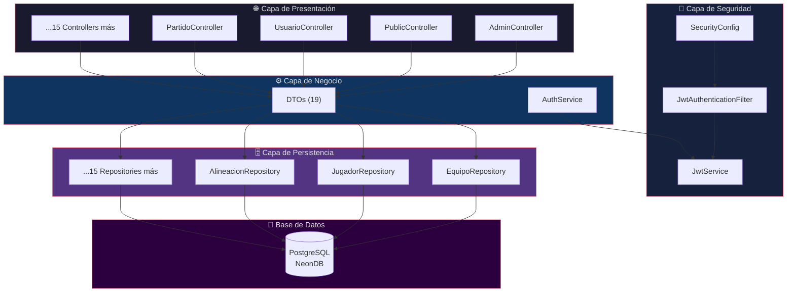

<
2. [Entidades JPA](#-entidades-jpa)
3. [Data Transfer Objects (DTOs)](#-data-transfer-objects)
4. [Controladores REST](#-controladores-rest)
5. [Seguridad (Spring Security 6 + JWT)](#-seguridad)
6. [Lógica de Negocio Clave](#-lógica-de-negocio-clave)
7. [Configuración](#-configuración)

---

## 🏗️ Arquitectura en Capas

El backend sigue una arquitectura **en capas estricta** con separación de responsabilidades:



### Paquete raíz: `com.DAMUnitedFC.backend_tfg`

```
com.DAMUnitedFC.backend_tfg/
├── config/               # SecurityConfig, CorsConfig, WebConfig, ApplicationConfig, OpenApiConfig
├── controller/           # 19 REST Controllers
├── dto/                  # 19 Data Transfer Objects
├── model/                # 18 Entidades JPA
├── repository/           # JpaRepository interfaces
├── security/             # JwtAuthenticationFilter
└── service/              # JwtService, AuthService
```

---

## 🗄️ Entidades JPA

El modelo de datos consta de **18 entidades** mapeadas con Hibernate/JPA:

### Entidades Core

| Entidad | Tabla | Descripción | Relaciones Principales |
|---------|-------|-------------|----------------------|
| `Usuario` | `usuario` | Base del sistema de usuarios. Implementa `UserDetails` | → Jugador, → Entrenador |
| `Jugador` | `jugador` | Perfil deportivo del jugador | → Usuario (M:1), → Equipo (M:1), → Alineacion (1:N) |
| `Entrenador` | `entrenador` | Técnico responsable de equipos | → Usuario (M:1), → Equipo (1:N) |
| `Equipo` | `equipo` | Grupo deportivo | → Categoría (M:1), → Entrenador (M:1), → Jugadores (1:N) |
| `Partido` | `partido` | Evento deportivo (partido o entrenamiento) | → Equipo (M:1), → Alineaciones (1:N) |
| `Alineacion` | `alineacion` | Registro de participación en partido | → Partido (M:1), → Jugador (M:1), → Equipo (M:1) |
| `Asistencia` | `asistencia` | Registro de asistencia a entrenamientos | → Partido (M:1), → Jugador (M:1) |
| `Categoria` | `categoria` | Rango de edad (Prebenjamín, Alevín, etc.) | → Equipos (1:N) |
| `Liga` | `liga` | Competición/división | — |
| `Incidencia` | `incidencia` | Sanciones, lesiones, observaciones | — |
| `Convocatoria` | `convocatoria` | Convocatoria de evento | → Jugadores (M:N) |
| `SolicitudInscripcion` | `solicitud_inscripcion` | Proceso de alta de nuevos jugadores | — |

### Entidades de Relación (Tablas Join)

| Entidad | Propósito |
|---------|-----------|
| `JugadorEquipo` / `JugadorEquipoId` | Histórico de equipos de un jugador (M:N) |
| `EquipoEntrenador` / `EquipoEntrenadorId` | Relación equipo-entrenador (M:N) |
| `ConvocatoriaJugador` / `ConvocatoriaJugadorId` | Jugadores en una convocatoria (M:N) |

### Modelo `Usuario` — Integración con Spring Security

La entidad `Usuario` implementa `UserDetails` para integrarse con Spring Security:

```java
@Entity
@Data
public class Usuario implements UserDetails {

    @Id @GeneratedValue(strategy = GenerationType.IDENTITY)
    private Integer idUsuario;
    private String nombre, apellidos;

    @Column(unique = true, nullable = false)
    private String email;

    @JsonIgnore                      // ← Evita serialización del hash
    private String passwordHash;

    private String rol;              // ADMIN | ENTRENADOR | JUGADOR

    @Override @JsonIgnore            // ← Evita bucle infinito de serialización
    public Collection<? extends GrantedAuthority> getAuthorities() {
        return List.of(new SimpleGrantedAuthority("ROLE_" + this.rol));
    }

    @Override @JsonIgnore
    public String getPassword() { return this.passwordHash; }

    @Override @JsonIgnore
    public String getUsername() { return this.email; }
}
```

> **`@JsonIgnore` estratégico:** Previene la serialización recursiva de campos confidenciales y métodos de `UserDetails` que causarían un Error 500. Ver [TROUBLESHOOTING.md](./TROUBLESHOOTING.md#3-bucles-infinitos-de-serialización-json-error-500).

### Modelo `Alineacion` — Centro de Datos de Rendimiento

```java
@Entity @Table(name = "alineacion") @Data
public class Alineacion {
    @Id @GeneratedValue private Long id;

    @ManyToOne private Partido partido;
    @ManyToOne private Jugador jugador;
    @ManyToOne private Equipo equipo;

    private Boolean esTitular;
    private Integer goles = 0;
    private Integer asistencias = 0;
    private Integer minutosJugados = 0;
    private Boolean tarjetaAmarilla = false;
    private Boolean tarjetaRoja = false;
    private Integer minutoEntrada, minutoSalida;
    private Boolean esCapitan = false;
    private Boolean esLanzadorPenaltis = false;
    private Boolean esLanzadorFaltas = false;
}
```

---

## 📦 Data Transfer Objects

Se utilizan **19 DTOs** para controlar la información que entra y sale del API:

| DTO | Propósito |
|-----|-----------|
| `LoginDto` | Credenciales de login (email + password) |
| `RegistroUsuario` | Datos de registro de nuevo usuario |
| `AuthResponseDto` | Token JWT de respuesta |
| `PublicTeamDto` | Equipo sin datos sensibles (vista pública) |
| `PublicPlayerDto` | Jugador con estadísticas calculadas (vista pública) |
| `EstadisticasJugadorDto` | Estadísticas agregadas por jugador |
| `AlineacionDto` / `AlineacionResponseDto` | Datos de alineación (entrada/salida) |
| `ActaDto` | Datos para cerrar un acta de partido |
| `EquipoDto` | Datos de equipo para Admin |
| `JugadorDto` | Datos de jugador para Admin |
| `EntrenadorDto` | Datos de entrenador |
| `ConvocatoriaDto` / `ConvocatoriaJugadorDto` | Convocatorias |
| `IncidenciaDto` | Incidencias |
| `PartidoDto` (implícito en Map) | Datos de partido |

---

## 🌐 Controladores REST

### Mapa de Endpoints

| Controller | Base Path | Métodos | Acceso |
|-----------|-----------|---------|--------|
| `UsuarioController` | `/api/auth/**` | POST login, POST register | Público |
| `PublicController` | `/api/public/**` | GET equipos, GET plantilla | Público |
| `AdminController` | `/api/admin/**` | CRUD completo (16+ endpoints) | JWT (ADMIN) |
| `EquipoController` | `/api/equipos/**` | GET equipos | Público (GET) |
| `JugadorController` | `/api/jugadores/**` | GET, filtros | Público (GET) |
| `EntrenadorController` | `/api/entrenadores/**` | GET | Público (GET) |
| `PartidoController` | `/api/partidos/**` | CRUD | JWT |
| `AlineacionController` | `/api/alineaciones/**` | CRUD | JWT |
| `ConvocatoriaController` | `/api/convocatorias/**` | CRUD | JWT |
| `IncidenciaController` | `/api/incidencias/**` | CRUD | JWT |
| `FileController` | `/api/uploads/**` | GET archivos | Público |
| `MediaController` | `/api/media/**` | Gestión media | JWT |
| `UserController` | `/api/users/**` | Perfil usuario | JWT |

### Endpoints Principales del `AdminController`

| Método | Endpoint | Descripción |
|--------|----------|-------------|
| GET | `/api/admin/candidatos` | Usuarios candidatos a ser jugadores |
| GET | `/api/admin/candidatos-entrenadores` | Usuarios candidatos a ser entrenadores |
| GET | `/api/admin/usuarios` | Todos los usuarios activos con sus perfiles |
| DELETE | `/api/admin/usuarios/{id}` | Eliminar usuario (cascada) |
| POST | `/api/admin/usuarios` | Crear usuario con rol |
| GET | `/api/admin/equipos` | Lista completa de equipos |
| POST | `/api/admin/equipos` | Crear equipo |
| POST | `/api/admin/asignar-equipo` | Asignar jugador a equipo |
| POST | `/api/admin/asignar-entrenador` | Asignar entrenador a equipo |
| POST | `/api/admin/partidos` | Crear partido (multipart/form-data) |
| POST | `/api/admin/entrenamientos` | Crear entrenamiento |
| DELETE | `/api/admin/eventos/{id}` | Borrar evento |
| POST | `/api/admin/cerrar-acta` | Cerrar acta con estadísticas |
| GET | `/api/admin/equipos/{id}` | Detalle equipo con jugadores y partidos |
| POST | `/api/admin/asistencia` | Guardar asistencia (pasar lista) |
| GET | `/api/admin/asistencia/{id}` | Obtener asistencia de un evento |

---

## 🔐 Seguridad

### Cadena de Filtros (`SecurityConfig`)

```java
http
    .cors(cors -> cors.configurationSource(corsConfigurationSource()))
    .csrf(AbstractHttpConfigurer::disable)
    .authorizeHttpRequests(auth -> auth
        .requestMatchers(HttpMethod.OPTIONS, "/**").permitAll()
        .requestMatchers("/api/auth/**").permitAll()
        .requestMatchers(HttpMethod.GET, "/api/equipos/**").permitAll()
        .requestMatchers(HttpMethod.GET, "/api/jugadores/**").permitAll()
        .requestMatchers("/api/public/**").permitAll()
        .requestMatchers(HttpMethod.GET, "/api/entrenadores/**").permitAll()
        .requestMatchers("/api/uploads/**", "/uploads/**").permitAll()
        .requestMatchers("/v3/api-docs/**", "/swagger-ui/**").permitAll()
        .anyRequest().authenticated()
    )
    .sessionManagement(sess -> sess.sessionCreationPolicy(SessionCreationPolicy.STATELESS))
    .addFilterBefore(jwtAuthFilter, UsernamePasswordAuthenticationFilter.class);
```

### Configuración CORS

```java
configuration.setAllowedOriginPatterns(Collections.singletonList("*"));
configuration.setAllowedMethods(Arrays.asList("GET","POST","PUT","DELETE","OPTIONS","PATCH"));
configuration.setAllowCredentials(true);
```

### Dependencias JWT (pom.xml)

```xml
<!-- JJWT 0.12.3 -->
<dependency>
    <groupId>io.jsonwebtoken</groupId>
    <artifactId>jjwt-api</artifactId>
    <version>0.12.3</version>
</dependency>
<dependency>
    <groupId>io.jsonwebtoken</groupId>
    <artifactId>jjwt-impl</artifactId>
    <version>0.12.3</version>
</dependency>
<dependency>
    <groupId>io.jsonwebtoken</groupId>
    <artifactId>jjwt-jackson</artifactId>
    <version>0.12.3</version>
</dependency>
```

---

## 💡 Lógica de Negocio Clave

### Cálculo Dinámico de Estadísticas

En el `PublicController`, las estadísticas de un jugador se **calculan en tiempo real** sumando los registros de `Alineacion`:

```java
List<Alineacion> participaciones = alineacionRepo.findByJugador(j);
int totalGoles = participaciones.stream()
    .mapToInt(a -> a.getGoles() != null ? a.getGoles() : 0).sum();
int totalAsist = participaciones.stream()
    .mapToInt(a -> a.getAsistencias() != null ? a.getAsistencias() : 0).sum();
```

**¿Por qué?** → Una sola fuente de verdad (`Alineacion`). Sin duplicados, sin inconsistencias.

### Cierre de Acta con Transaccionalidad

El método `cerrarActaAdmin` en `AdminController` es **transaccional**:
1. Actualiza el resultado del partido (goles favor/contra).
2. Guarda todas las entradas de `Alineacion` con sus estadísticas.
3. Cambia el estado del partido a `FINALIZADO`.
4. Todo dentro de una transacción: si falla algo, se revierte todo.

### Creación de Partidos con Multipart Flexible

```java
@PostMapping("/partidos")
public ResponseEntity<?> crearPartido(
    @RequestParam("idEquipo") Integer idEquipo,
    @RequestParam("rival") String rival,
    @RequestParam("lugar") String lugar,
    @RequestParam("fechaHora") String fechaHoraStr,
    @RequestParam("tipo") String tipo,
    @RequestParam(value = "escudoRivalUrl", required = false) String escudoRivalUrl,
    @RequestParam(value = "file", required = false) MultipartFile file
)
```

> Acepta tanto URL externa como archivo subido. Ver [TROUBLESHOOTING.md](./TROUBLESHOOTING.md#2-error-415-unsupported-media-type-en-formularios-flexibles) para el contexto del diseño.

---

## ⚙️ Configuración

### `application.properties` (Estructura)

```properties
# Base de Datos (NeonDB)
spring.datasource.url=jdbc:postgresql://<host>.neon.tech/<database>?sslmode=require
spring.datasource.username=<usuario>
spring.datasource.password=<contraseña>
spring.datasource.driver-class-name=org.postgresql.Driver

# JPA/Hibernate
spring.jpa.hibernate.ddl-auto=validate
spring.jpa.show-sql=true
spring.jpa.properties.hibernate.dialect=org.hibernate.dialect.PostgreSQLDialect

# JWT
application.security.jwt.secret-key=<clave-secreta-256-bits>
application.security.jwt.expiration=86400000  # 24 horas en ms

# Servidor
server.port=8080
```

### `pom.xml` — Dependencias Principales

| Dependencia | Propósito |
|------------|-----------|
| `spring-boot-starter-web` | REST API |
| `spring-boot-starter-data-jpa` | ORM/Hibernate |
| `spring-boot-starter-security` | Spring Security 6 |
| `spring-boot-starter-validation` | Bean Validation |
| `postgresql` | Driver PostgreSQL |
| `jjwt-api/impl/jackson` (0.12.3) | JWT tokens |
| `lombok` | Reducción de boilerplate |
| `springdoc-openapi-starter-webmvc-ui` (2.8.3) | Swagger/OpenAPI |

---

<div align="center">

[← Volver al README](./README.md) · [Frontend →](./FRONTEND.md) · [Troubleshooting →](./TROUBLESHOOTING.md)

</div>
]]>
