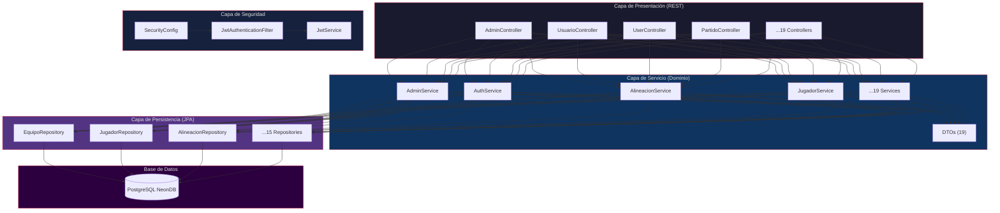

# 📘 BACKEND.md — Documentación Técnica del Backend

<div align="center">

**DAM United FC · Spring Boot 3.5.7 · Java 21 · PostgreSQL**

</div>

---

## 📋 Índice

1. [Arquitectura en Capas](#-arquitectura-en-capas)
2. [Entidades JPA](#-entidades-jpa)
3. [Data Transfer Objects (DTOs)](#-data-transfer-objects)
4. [Controladores REST](#-controladores-rest)
5. [Seguridad (Spring Security 6 + JWT)](#-seguridad)
6. [Lógica de Negocio Clave](#-lógica-de-negocio-clave)
7. [📁 Gestión de Ficheros](#-gestión-de-ficheros)
8. [⚙️ Configuración](#-configuración)

---

## 🏗️ Arquitectura en Capas (Refactorizada)

El backend sigue una arquitectura de **Capa de Servicio (Service Layer)** para centralizar la lógica de negocio y desacoplar los controladores de la persistencia:



### Paquete raíz: `com.DAMUnitedFC.backend_tfg`

```
com.DAMUnitedFC.backend_tfg/
├── config/               # Configuración de Seguridad, CORS y OpenAPI
├── controller/           # Controladores REST (Delegación a Capa de Servicio)
├── dto/                  # Objetos de Transferencia de Datos
├── model/                # Entidades JPA (Persistencia)
├── repository/           # Interfaces de Acceso a Datos (Spring Data JPA)
├── security/             # Componentes de Seguridad (JWT y Auth)
└── service/              # 19 Servicios de Dominio (Lógica de Negocio)
```

### Patrones Implementados

- **Service Layer**: Toda la lógica de negocio y orquestación se encuentra en servicios.
- **Inyección de Dependencias**: Inyección por Constructor **total y absoluta** en los 19 servicios de dominio (uso de campos `final` y constructores explícitos), eliminando por completo el uso de `@Autowired` en campos para una mejor testeabilidad y robustez.
- **Transaccionalidad**: Control de transacciones centrado en la capa de servicios mediante `@Transactional`.

---

## ⚙️ Servicios de Dominio (Service Layer)

Se han implementado **19 servicios** para orquestar la funcionalidad del club:

| Servicio | Propósito Clave |
|----------|-----------------|
| `AdminService` | Gestión administrativa de usuarios, equipos y cierre de actas. |
| `AuthService` | Manejo de registro, roles automáticos y autenticación. |
| `AlineacionService` | Gestión de fichas de partido, titulares y estadísticas. |
| `JugadorService` | Gestión de perfiles deportivos y estadísticas de jugadores. |
| `EntrenadorService` | Gestión de técnicos y asignaciones a equipos. |
| `EquipoService` | Gestión de la estructura de equipos y categorías. |
| `PartidoService` | Calendario de eventos, partidos y entrenamientos. |
| `UsuarioService` | Gestión de identidad y perfiles. Incluye lógica de recuperación de cuenta (`findByEmail`, `resetPassword`). |
| `PublicService` | Suministro de datos optimizados para vistas públicas. |
| `EmailService` | Notificaciones y comunicaciones vía correo electrónico. |
| `JwtService` | Generación y validación de tokens de seguridad JWT. |

---

## 🌐 Controladores REST

El API está organizado en controladores especializados que delegan la lógica de negocio a la capa de servicios. Se ha eliminado el acceso directo a repositorios desde los controladores.

### Mapa de Endpoints Principal

| Controller | Base Path | Responsabilidad Primaria | Acceso |
|-----------|-----------|--------------------------|--------|
| `UsuarioController` | `/api/auth/**` | Login, Registro, Recuperación (Forgot/Reset) | Público |
| `UserController` | `/api/usuarios/**` | Gestión de perfiles, roles y estados (Activar/Desactivar) | JWT |
| `EquipoController` | `/api/equipos/**` | Estructura, asignación de técnicos y jugadores | Público (GET) |
| `JugadorController` | `/api/jugadores/**` | Perfiles deportivos, lesiones y estadísticas | Público (GET) |
| `PartidoController` | `/api/partidos/**` | Calendario, eventos y gestión de resultados | JWT |
| `AlineacionController` | `/api/alineaciones/**` | Gestión de actas, titulares y estadísticas de campo | JWT |
| `ConvocatoriaController` | `/api/convocatoria/**` | Gestión de citas oficiales y asistencia | JWT |
| `SolicitudController` | `/api/solicitudinscripcion/**` | Proceso de alta de nuevos aspirantes | JWT / Público |
| `IncidenciaController` | `/api/incidencia/**` | Registro de lesiones, sanciones y seguimiento | JWT |
| `FileController` | `/api/uploads/**` | Servido de archivos estáticos (multimedia) | Público |

> **💡 Nota Semántica sobre Usuarios:**
> - **`UsuarioController` (`/api/auth`)**: Se encarga del ciclo de vida de la **identidad** del usuario (login, registro, "quién soy yo", recuperar contraseña).
> - **`UserController` (`/api/usuarios`)**: Se encarga del **perfil y la gestión** (listar usuarios, ver detalles, actualizar datos, cambiar roles).

### Endpoints Clave por Dominio

#### 🔐 Identidad y Auth (`/api/auth`)
- `POST /login`: Retorna JWT + RefreshToken + Datos de usuario.
- `POST /register`: Registro inicial de usuario (rol predeterminado).
- `POST /forgot-password`: Envío de token de recuperación vía email.
- `POST /reset-password`: Cambio de contraseña usando token válido.

#### 📋 Convocatorias (`/api/convocatoria`)
- `GET /equipo/{id}`: Lista todas las convocatorias de un equipo.
- `POST /attendance`: Actualización masiva de estado de asistencia (Presente/Ausente/Justificado).
- `GET /upcoming`: Próximos eventos (7 días vista).

#### 🚑 Incidencias y Salud (`/api/incidencia`)
- `POST /`: Registro de nueva incidencia (Lesión, Sanción, Observación).
- `PUT /{id}/follow-up`: Añadir seguimiento médico o técnico a una incidencia abierta.
- `PUT /{id}/close`: Cierre definitivo con resolución.

---

## 🗄️ Entidades JPA

El modelo de datos consta de **18 entidades** mapeadas con Hibernate/JPA:

### Entidades Core

| Entidad | Tabla | Descripción | Relaciones Principales |
|---------|-------|-------------|----------------------|
| `Usuario` | `usuario` | Base del sistema de usuarios. Implementa `UserDetails` | → Jugador, → Entrenador |
| `Jugador` | `jugador` | Perfil deportivo del jugador | → Usuario (M:1), → Equipo (M:1), → Alineacion (1:N) |
| `Entrenador` | `entrenador` | Técnico responsable de equipos | → Usuario (M:1), → Equipo (1:N) |
| `Equipo` | `equipo` | Grupo deportivo | → Categoría (M:1), → Entrenador (M:1), → Jugadores (1:N) |
| `Partido` | `partido` | Evento deportivo (partido o entrenamiento) | → Equipo (M:1), → Alineaciones (1:N) |
| `Alineacion` | `alineacion` | Registro de participación en partido | → Partido (M:1), → Jugador (M:1), → Equipo (M:1) |
| `Asistencia` | `asistencia` | Registro de asistencia a entrenamientos | → Partido (M:1), → Jugador (M:1) |
| `Categoria` | `categoria` | Rango de edad (Prebenjamín, Alevín, etc.) | → Equipos (1:N) |
| `Liga` | `liga` | Competición/división | — |
| `Incidencia` | `incidencia` | Sanciones, lesiones, observaciones | — |
| `Convocatoria` | `convocatoria` | Convocatoria de evento | → Jugadores (M:N) |
| `SolicitudInscripcion` | `solicitud_inscripcion` | Proceso de alta de nuevos jugadores | — |

### Entidades de Relación (Tablas Join)

| Entidad | Propósito |
|---------|-----------|
| `JugadorEquipo` / `JugadorEquipoId` | Histórico de equipos de un jugador (M:N) |
| `EquipoEntrenador` / `EquipoEntrenadorId` | Relación equipo-entrenador (M:N) |
| `ConvocatoriaJugador` / `ConvocatoriaJugadorId` | Jugadores en una convocatoria (M:N) |

### Modelo `Usuario` — Integración con Spring Security

La entidad `Usuario` implementa `UserDetails` para integrarse con Spring Security:

```java
@Entity
@Data
public class Usuario implements UserDetails {

    @Id @GeneratedValue(strategy = GenerationType.IDENTITY)
    private Integer idUsuario;
    private String nombre, apellidos;

    @Column(unique = true, nullable = false)
    private String email;

    @JsonIgnore                      // Evita serializacion del hash
    private String passwordHash;

    private String rol;              // ADMIN | ENTRENADOR | JUGADOR

    @Override @JsonIgnore            // Evita bucle infinito de serializacion
    public Collection<? extends GrantedAuthority> getAuthorities() {
        return List.of(new SimpleGrantedAuthority("ROLE_" + this.rol));
    }

    @Override @JsonIgnore
    public String getPassword() { return this.passwordHash; }

    @Override @JsonIgnore
    public String getUsername() { return this.email; }
}
```

> **`@JsonIgnore` estratégico:** Previene la serialización recursiva de campos confidenciales y métodos de `UserDetails` que causarían un Error 500. Ver [TROUBLESHOOTING.md](./TROUBLESHOOTING.md#3-bucles-infinitos-de-serialización-json-error-500).

### Modelo `Alineacion` — Centro de Datos de Rendimiento

```java
@Entity
@Table(name = "alineacion")
@Data
public class Alineacion {

    @Id @GeneratedValue
    private Long id;

    @ManyToOne private Partido partido;
    @ManyToOne private Jugador jugador;
    @ManyToOne private Equipo equipo;

    private Boolean esTitular;
    private Integer goles = 0;
    private Integer asistencias = 0;
    private Integer minutosJugados = 0;
    private Boolean tarjetaAmarilla = false;
    private Boolean tarjetaRoja = false;
    private Integer minutoEntrada, minutoSalida;
    private Boolean esCapitan = false;
    private Boolean esLanzadorPenaltis = false;
    private Boolean esLanzadorFaltas = false;
}
```

---

## 📦 Data Transfer Objects

Se utilizan **19 DTOs** para controlar la información que entra y sale del API:

| DTO | Propósito |
|-----|-----------|
| `LoginDto` | Credenciales de login (email + password) |
| `RegistroUsuario` | Datos de registro de nuevo usuario |
| `AuthResponseDto` | Token JWT de respuesta |
| `PublicTeamDto` | Equipo sin datos sensibles (vista pública) |
| `PublicPlayerDto` | Jugador con estadísticas calculadas (vista pública) |
| `EstadisticasJugadorDto` | Estadísticas agregadas por jugador |
| `AlineacionDto` / `AlineacionResponseDto` | Datos de alineación (entrada/salida) |
| `ActaDto` | Datos para cerrar un acta de partido |
| `EquipoDto` | Datos de equipo para Admin |
| `JugadorDto` | Datos de jugador para Admin |
| `EntrenadorDto` | Datos de entrenador |
| `ConvocatoriaDto` / `ConvocatoriaJugadorDto` | Convocatorias |
| `IncidenciaDto` | Incidencias |
| `PartidoDto` (implícito en Map) | Datos de partido |

---

## 🔐 Seguridad

### Cadena de Filtros (`SecurityConfig`)

```java
http
    .cors(cors -> cors.configurationSource(corsConfigurationSource()))
    .csrf(AbstractHttpConfigurer::disable)
    .authorizeHttpRequests(auth -> auth
        .requestMatchers(HttpMethod.OPTIONS, "/**").permitAll()
        .requestMatchers("/api/auth/**").permitAll()
        .requestMatchers(HttpMethod.GET, "/api/equipos/**").permitAll()
        .requestMatchers(HttpMethod.GET, "/api/jugadores/**").permitAll()
        .requestMatchers("/api/public/**").permitAll()
        .requestMatchers(HttpMethod.GET, "/api/entrenadores/**").permitAll()
        .requestMatchers("/api/uploads/**", "/uploads/**").permitAll()
        .requestMatchers("/v3/api-docs/**", "/swagger-ui/**").permitAll()
        .anyRequest().authenticated()
    )
    .sessionManagement(sess -> sess.sessionCreationPolicy(SessionCreationPolicy.STATELESS))
    .addFilterBefore(jwtAuthFilter, UsernamePasswordAuthenticationFilter.class);
```

### Configuración CORS

```java
configuration.setAllowedOriginPatterns(Collections.singletonList("*"));
configuration.setAllowedMethods(Arrays.asList("GET","POST","PUT","DELETE","OPTIONS","PATCH"));
configuration.setAllowCredentials(true);
```

### Dependencias JWT (pom.xml)

```xml
<!-- JJWT 0.12.3 -->
<dependency>
    <groupId>io.jsonwebtoken</groupId>
    <artifactId>jjwt-api</artifactId>
    <version>0.12.3</version>
</dependency>
<dependency>
    <groupId>io.jsonwebtoken</groupId>
    <artifactId>jjwt-impl</artifactId>
    <version>0.12.3</version>
</dependency>
<dependency>
    <groupId>io.jsonwebtoken</groupId>
    <artifactId>jjwt-jackson</artifactId>
    <version>0.12.3</version>
</dependency>
```

---

## 💡 Lógica de Negocio Clave

### Cálculo Dinámico de Estadísticas

En el `PublicController`, las estadísticas de un jugador se **calculan en tiempo real** sumando los registros de `Alineacion`:

```java
List<Alineacion> participaciones = alineacionRepo.findByJugador(j);
int totalGoles = participaciones.stream()
    .mapToInt(a -> a.getGoles() != null ? a.getGoles() : 0).sum();
int totalAsist = participaciones.stream()
    .mapToInt(a -> a.getAsistencias() != null ? a.getAsistencias() : 0).sum();
```

**¿Por qué?** → Una sola fuente de verdad (`Alineacion`). Sin duplicados, sin inconsistencias.

### Cierre de Acta con Transaccionalidad

El método `cerrarActaAdmin` en `AdminController` es **transaccional**:

1. Actualiza el resultado del partido (goles favor/contra).
2. Guarda todas las entradas de `Alineacion` con sus estadísticas.
3. Cambia el estado del partido a `FINALIZADO`.
4. Todo dentro de una transacción: si falla algo, se revierte todo.

### Creación de Partidos con Multipart Flexible

```java
@PostMapping("/partidos")
public ResponseEntity<?> crearPartido(
    @RequestParam("idEquipo") Integer idEquipo,
    @RequestParam("rival") String rival,
    @RequestParam("lugar") String lugar,
    @RequestParam("fechaHora") String fechaHoraStr,
    @RequestParam("tipo") String tipo,
    @RequestParam(value = "escudoRivalUrl", required = false) String escudoRivalUrl,
    @RequestParam(value = "file", required = false) MultipartFile file
)
```

> Acepta tanto URL externa como archivo subido. Ver [TROUBLESHOOTING.md](./TROUBLESHOOTING.md#2-error-415-unsupported-media-type-en-formularios-flexibles) para el contexto del diseño.

---

## 📁 Gestión de Ficheros

El sistema gestiona ficheros en tres vertientes diferenciadas: subida y servido de imágenes multimedia a través de la API REST, generación de documentos PDF en el lado del cliente, y lectura de ficheros de configuración y caché por parte de los frameworks de backend y frontend. La estrategia general prioriza la **resiliencia frente a entornos efímeros** (PaaS), evitando dependencias de almacenamiento local persistente en producción.

| Tipo | Componente | Tecnología | Propósito |
|------|-----------|-----------|----------|
| Escritura | `FileController` | Spring `MultipartFile` | Subida de imágenes (escudos de equipo, fotos de perfil) con blindaje contra Path Traversal |
| Escritura | Frontend (PDF) | jsPDF + html2canvas | Generación de PDFs: Convocatorias, Actas de Partido y Estadísticas de Temporada (patrón Hidden Container para Shadow DOM de Ionic) |
| Escritura | Logging | SLF4J (Logback) | Escritura de logs de aplicación, sustituyendo `e.printStackTrace()` por logging estructurado |
| Lectura | Spring Boot | `application.properties` | Configuración de datasource, JWT secret, credenciales de Twilio y Firebase vía variables de entorno |
| Lectura | `FileController` | Spring `Resource` | Servido de ficheros multimedia subidos (endpoint `/api/uploads/**`) |
| Lectura | Angular PWA | `ngsw-config.json` | Estrategia de caché del Service Worker para funcionamiento offline |

> **🛡️ Seguridad en subida de ficheros:** El `FileController` normaliza las rutas recibidas y bloquea cualquier secuencia `..` para prevenir ataques de Path Traversal. Los ficheros se almacenan en un directorio controlado fuera del classpath.

### Decisión Arquitectónica: Gestión de Imágenes en Producción

Durante el despliegue en Render (PaaS), se identificó que el sistema de archivos local es **efímero**: cada redeploy elimina los ficheros almacenados en disco. Se evaluaron cuatro alternativas para la persistencia de imágenes:

| Opción | Evaluación | Resultado |
|--------|-----------|----------|
| Disco local | Sistema de ficheros efímero en Render; los ficheros se pierden en cada redeploy | ❌ Descartada |
| Base de datos (BLOB) | Impacto severo en rendimiento y tamaño de la BD PostgreSQL | ❌ Descartada |
| Almacenamiento externo (S3/Cloudinary) | Coste económico inasumible en tier educativo/gratuito | ❌ Descartada |
| **Sistema híbrido: URLs externas + fallback dinámico** | Gratuito, resiliente y sin dependencias adicionales de infraestructura | ✅ **Elegida** |

La solución adoptada combina **URLs externas** para imágenes de referencia (escudos de rivales, fotos importadas) con un sistema de **fallback de avatares dinámicos** generados mediante `ui-avatars.com` cuando la imagen original no está disponible. Esta aproximación elimina la dependencia del sistema de ficheros local en producción, garantiza que la interfaz nunca muestre imágenes rotas y no añade costes de infraestructura al proyecto.

> Para el detalle completo de implementación y los problemas resueltos durante el diseño de esta solución, consultar [TROUBLESHOOTING.md](../troubleshooting/TROUBLESHOOTING.md#1) (Caso 1).

---

## ⚙️ Configuración

### `application.properties` (Estructura)

```properties
# Base de Datos (NeonDB)
spring.datasource.url=jdbc:postgresql://<host>.neon.tech/<database>?sslmode=require
spring.datasource.username=<usuario>
spring.datasource.password=<contrasena>
spring.datasource.driver-class-name=org.postgresql.Driver

# JPA/Hibernate
spring.jpa.hibernate.ddl-auto=validate
spring.jpa.show-sql=true
spring.jpa.properties.hibernate.dialect=org.hibernate.dialect.PostgreSQLDialect

# JWT
application.security.jwt.secret-key=<clave-secreta-256-bits>
application.security.jwt.expiration=86400000

# Servidor
server.port=8080
```

### `pom.xml` — Dependencias Principales

| Dependencia | Propósito |
|------------|-----------|
| `spring-boot-starter-web` | REST API |
| `spring-boot-starter-data-jpa` | ORM/Hibernate |
| `spring-boot-starter-security` | Spring Security 6 |
| `spring-boot-starter-validation` | Bean Validation |
| `postgresql` | Driver PostgreSQL |
| `jjwt-api/impl/jackson` (0.12.3) | JWT tokens |
| `lombok` | Reducción de boilerplate |
| `springdoc-openapi-starter-webmvc-ui` (2.8.3) | Swagger/OpenAPI |

---

<div align="center">

[← Volver al README](./README.md) · [Frontend →](./FRONTEND.md) · [Troubleshooting →](./TROUBLESHOOTING.md)

</div>
