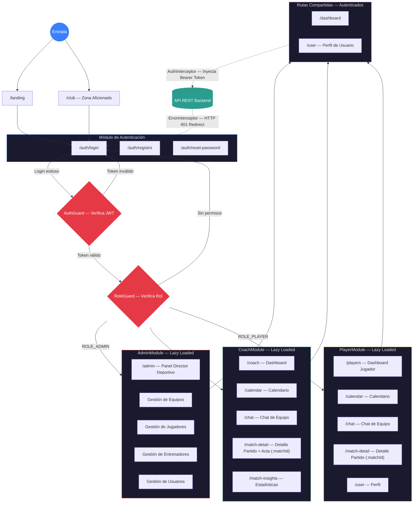
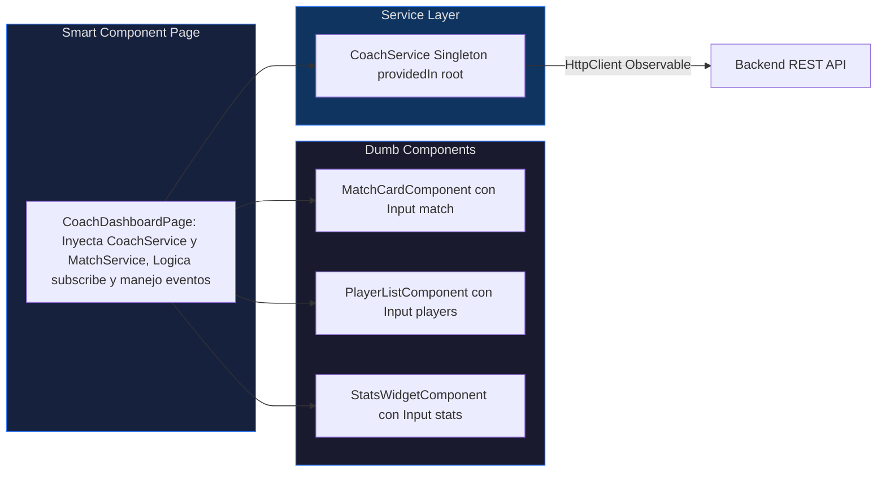
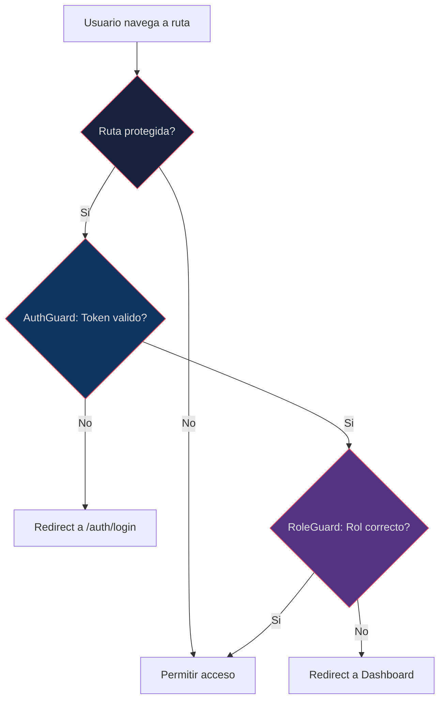

# 📗 FRONTEND.md — Documentación Técnica del Frontend

<div align="center">

**DAM United FC · Angular 18 · Ionic 7 · RxJS · TypeScript**

</div>

---

## 📋 Índice

1. [Arquitectura Modular](#-arquitectura-modular)
2. [Lazy Loading y Routing](#-lazy-loading-y-routing)
3. [Grafo de Navegación](#️-grafo-de-navegación)
4. [Core Module (Singleton)](#-core-module)
5. [Feature Modules](#-feature-modules)
6. [Patrón Smart-Dumb Components](#-patrón-smart-dumb-components)
7. [Servicios HTTP (Capa de Datos)](#-servicios-http)
8. [Guards e Interceptors](#-guards-e-interceptors)
9. [Gestión de Estado con RxJS](#-gestión-de-estado-con-rxjs)
10. [UI Adaptativa (Ionic Components)](#-ui-adaptativa)
11. [Configuración de Entorno](#-configuración-de-entorno)

---

## 🏗️ Arquitectura Modular

```mermaid
graph TB
    subgraph Root["AppModule"]
        AR["AppRoutingModule Lazy Loading"]
        AC["AppComponent"]
    end

    subgraph Core["Core Singleton"]
        direction TB
        G["Guards: Auth, NoAuth, Role"]
        I["Interceptors: Auth, Error"]
        S["Services 18+: Auth, Storage, Admin, Coach, Match, Open, Player, Team"]
    end

    subgraph Features["Feature Modules Lazy Loaded"]
        direction TB
        M1["LandingModule"]
        M2["AuthModule"]
        M3["AdminModule"]
        M4["CoachModule"]
        M5["PlayerModule"]
        M6["UserModule"]
        M7["CalendarModule"]
        M8["ClubModule"]
        M9["MatchDetailModule"]
        M10["DashboardModule"]
    end

    subgraph Shared["SharedModule"]
        SM["Componentes reutilizables, Pipes, Modelos, Interfaces"]
    end

    AR --> M1 & M2 & M3 & M4 & M5 & M6 & M7 & M8 & M9 & M10
    Core --> Features
    Shared --> Features

    style Root fill:#1a1a2e,stroke:#3880ff,color:#e0e0e0
    style Core fill:#0f3460,stroke:#3880ff,color:#e0e0e0
    style Features fill:#16213e,stroke:#3880ff,color:#e0e0e0
    style Shared fill:#533483,stroke:#3880ff,color:#e0e0e0
```



### Estructura de directorios

```
frontend/src/app/
├── app.module.ts                # Root module
├── app-routing.module.ts        # Lazy loading routes (15+ rutas)
├── app.component.ts/html/scss   # Root component
│
├── core/                        # Singleton services e infrastructure
│   ├── guards/                  # AuthGuard, NoAuthGuard, RoleGuard (+1)
│   ├── interceptors/            # AuthInterceptor, ErrorInterceptor (+1)
│   └── services/                # 18 subdirectorios de servicios
│       ├── admin/               # AdminService
│       ├── auth/                # AuthService
│       ├── coach/               # CoachService
│       ├── match/               # MatchService
│       ├── open/                # OpenService (endpoints publicos)
│       ├── player/              # PlayerService
│       ├── storage/             # StorageService (localStorage)
│       ├── team/                # TeamService
│       ├── user/                # UserService
│       ├── convocation/         # ConvocationService
│       ├── incident/            # IncidentService
│       ├── media/               # MediaService
│       ├── news/                # NewsService
│       ├── notification/        # NotificationService
│       ├── common/              # CommonService
│       ├── api/                 # ApiService (HTTP base)
│       ├── state/               # Estado global (3 archivos)
│       └── index.ts             # Barrel exports
│
├── modules/                     # 10 Feature Modules
│   ├── landing/                 # Pagina publica del club
│   ├── auth/                    # Login + Registro
│   ├── admin/                   # Panel Director Deportivo
│   │   └── pages/
│   │       ├── team-detail/     # Detalle de equipo
│   │       └── training-attendance/  # Lista de asistencia
│   ├── coach/                   # Dashboard Entrenador
│   │   └── pages/
│   │       ├── coach-dashboard/ # Dashboard principal
│   │       ├── team-stats/      # Estadisticas de equipo
│   │       ├── my-team/         # Gestionar plantilla
│   │       ├── coach-profile/   # Perfil entrenador
│   │       ├── tactics/         # Pizarra tactica
│   │       ├── edit-match/      # Editar partido/alineacion
│   │       └── convocations/    # Crear/detalle convocatoria
│   ├── players/                 # Dashboard Jugador
│   ├── user/                    # Perfil y configuracion
│   ├── dashboard/               # Dashboard generico
│   ├── club/                    # Vista club
│   ├── calendar/                # Calendario de eventos
│   └── match-detail/            # Detalle de partido
│
└── shared/                      # Componentes, pipes, modelos
```

---

## 🔄 Lazy Loading y Routing

Todos los Feature Modules se cargan bajo demanda usando la sintaxis `loadChildren`:

```typescript
// app-routing.module.ts
const routes: Routes = [
  { path: '', redirectTo: 'landing', pathMatch: 'full' },

  // PUBLICO
  {
    path: 'landing',
    loadChildren: () => import('./modules/landing/landing.module')
      .then(m => m.LandingPageModule)
  },

  // AUTH
  {
    path: 'auth',
    loadChildren: () => import('./modules/auth/auth.module')
      .then(m => m.AuthModule)
  },

  // ADMIN
  {
    path: 'admin',
    loadChildren: () => import('./modules/admin/admin.module')
      .then(m => m.AdminModule)
  },

  // COACH (multiples sub-rutas)
  {
    path: 'coach-dashboard',
    loadChildren: () => import('./modules/coach/pages/coach-dashboard/coach-dashboard.module')
      .then(m => m.CoachDashboardPageModule)
  },
  { path: 'coach/stats', /* ... */ },
  { path: 'coach/my-team', /* ... */ },
  { path: 'tactics/:matchId', /* ... */ },
  { path: 'edit-match/:id', /* ... */ },

  // JUGADOR
  { path: 'player-dashboard', /* ... */ },

  // COMUNES
  { path: 'profile', /* ... */ },
  { path: 'match-detail/:id', /* ... */ },
  { path: 'calendar', /* ... */ },
  { path: 'club', /* ... */ },
  { path: 'team-detail/:id', /* ... */ },
  { path: 'training-attendance/:id', /* ... */ },

  // Wildcard
  { path: '**', redirectTo: 'landing' }
];
```

> **15+ rutas lazy-loaded** que garantizan que solo se descargue el código necesario para cada vista.

---

## 🗺️ Grafo de Navegación

El siguiente diagrama representa el flujo de navegación completo de la aplicación, incluyendo las rutas públicas, el módulo de autenticación, la redirección basada en roles y los módulos protegidos de cada tipo de usuario.



### Estrategia de Lazy Loading

La aplicación implementa una estrategia de **lazy loading** a nivel de módulo a través de `AppRoutingModule`. Cada feature module (`AdminModule`, `CoachModule`, `PlayerModule`, `AuthModule`, `LandingModule`) se carga bajo demanda mediante `loadChildren`, lo que significa que el bundle inicial solo contiene el core de la aplicación y los módulos compartidos. Cuando un usuario navega por primera vez a una ruta protegida, Angular descarga el chunk correspondiente al módulo de ese rol, reduciendo significativamente el tiempo de carga inicial y optimizando el consumo de datos en dispositivos móviles.

### Funcionamiento de AuthGuard y RoleGuard

El sistema de protección de rutas se basa en dos guards que actúan en cascada. **`AuthGuard`** se ejecuta primero y verifica la existencia y validez del token JWT almacenado localmente; si el token no existe o ha expirado, redirige al usuario a `/auth/login`. Si el token es válido, **`RoleGuard`** toma el control y extrae el rol del usuario del token decodificado, comparándolo con los roles permitidos definidos en el `data` de cada ruta. La comparación es **insensible a mayúsculas** y soporta el prefijo `ROLE_` (por ejemplo, `ROLE_ADMIN` y `admin` se consideran equivalentes), lo que proporciona flexibilidad frente a variaciones en el formato del backend.

### Paso de Parámetros entre Rutas

La comunicación entre módulos se realiza mediante **route params** y **query params**. Los identificadores de equipo (`teamId`), partido (`matchId`) y jugador (`playerId`) se pasan como segmentos dinámicos de la URL (por ejemplo, `/match-detail/:matchId`), lo que permite deep linking y compartir URLs específicas. Para datos más complejos o filtros temporales, se utilizan query params que no afectan a la estructura de la ruta. Los componentes destino inyectan `ActivatedRoute` y se suscriben a `params` o `queryParams` de forma reactiva, garantizando que los cambios de parámetros sin destrucción del componente se gestionen correctamente.

### Gestión del Botón Atrás con NavController

En un entorno híbrido Ionic + Angular, la gestión del botón atrás físico (Android) y el swipe-back (iOS) requiere un tratamiento especial. La aplicación delega esta responsabilidad al **`NavController`** de Ionic, que mantiene una pila de navegación propia sincronizada con el router de Angular. Al utilizar `NavController.back()` en lugar de `Location.back()` o `Router.navigate()`, se garantiza que las animaciones de transición sean coherentes con la plataforma nativa (slide en iOS, fade en Android). Además, `NavController` evita comportamientos inesperados en flujos modales o de autenticación, donde un `back()` convencional podría llevar al usuario a pantallas previas al login.

---

## 🔧 Core Module

El Core Module proporciona servicios **Singleton** inyectados en el `root` que persisten durante toda la sesión:

### Servicios (18+)

| Servicio | Fichero | Responsabilidad |
|----------|---------|----------------|
| `AuthService` | `auth/` | Login, register, logout, estado de sesión |
| `StorageService` | `storage/` | Persistencia en `localStorage` (token, usuario) |
| `AdminService` | `admin/` | HTTP para operaciones Admin (CRUD usuarios, equipos, partidos) |
| `CoachService` | `coach/` | HTTP para operaciones Coach (alineaciones, convocatorias) |
| `MatchService` | `match/` | HTTP para partidos |
| `OpenService` | `open/` | HTTP para endpoints públicos (`/api/public/**`) |
| `PlayerService` | `player/` | HTTP para datos de jugador |
| `TeamService` | `team/` | HTTP para equipos |
| `UserService` | `user/` | HTTP para perfil de usuario |
| `ConvocationService` | `convocation/` | Gestión de convocatorias |
| `IncidentService` | `incident/` | Gestión de incidencias |
| `MediaService` | `media/` | Subida y gestión de archivos |
| `NewsService` | `news/` | Noticias del club |
| `NotificationService` | `notification/` | Notificaciones UI (Toasts) |
| `CommonService` | `common/` | Utilidades compartidas |
| `ApiService` | `api/` | Cliente HTTP base con error handling |
| `TeamStateService` | `state/` | Estado global de equipos (Reactive) |
| `UserStateService` | `state/` | Estado global de usuario (Reactive) |

---

## 📱 Feature Modules

### `AuthModule` — Autenticación

- **LoginPage:** Formulario con validaciones reactivas. Llama a `AuthService.login()`.
- **RegisterPage:** Registro con validación de campos. Llama a `AuthService.register()`.
- Ambos redirigen según el rol del usuario tras autenticación exitosa.

### `AdminModule` — Panel Director Deportivo

- Gestión CRUD de usuarios, equipos y eventos (partidos/entrenamientos).
- Asignación de jugadores a equipos y entrenadores a equipos.
- Cierre de actas con estadísticas.
- Sub-páginas: `team-detail`, `training-attendance`.

### `CoachModule` — Dashboard Entrenador

- **CoachDashboard:** Vista principal con próximos partidos y entrenamientos.
- **TeamStats:** Estadísticas agregadas del equipo.
- **MyTeam:** Gestión de plantilla.
- **Tactics:** Pizarra táctica interactiva.
- **EditMatch:** Gestión de alineaciones (titulares/suplentes).
- **Convocations:** Crear y ver detalle de convocatorias.
- **CoachProfile:** Perfil del entrenador.

### `PlayerModule` — Dashboard Jugador

- Visualización de partidos, estadísticas personales y perfil.

### `LandingModule` — Página Pública

- Vista del club sin autenticación.
- Consume datos de `OpenService` → `PublicController`.

---

## 🧩 Patrón Smart-Dumb Components



**Smart Components (Pages):**

- Inyectan servicios.
- Suscriben a Observables.
- Manejan la lógica de vista.
- Pasan datos hacia abajo vía `@Input()`.

**Dumb Components (UI):**

- Reciben datos por `@Input()`.
- Emiten eventos por `@Output()`.
- Sin lógica de negocio.
- Reutilizables entre módulos.

---

## 🌐 Servicios HTTP

Todos los servicios HTTP siguen el mismo patrón:

```typescript
// Ejemplo: admin.service.ts
@Injectable({ providedIn: 'root' })
export class AdminService {

  private apiUrl = environment.apiUrl;

  constructor(private http: HttpClient) {}

  getEquipos(): Observable<any[]> {
    return this.http.get<any[]>(`${this.apiUrl}/admin/equipos`);
  }

  crearPartido(formData: FormData): Observable<any> {
    return this.http.post(`${this.apiUrl}/admin/partidos`, formData);
  }

  cerrarActa(acta: any): Observable<any> {
    return this.http.post(`${this.apiUrl}/admin/cerrar-acta`, acta);
  }
}
```

> **Convención de URL:** El `environment.apiUrl` termina en `/api` **sin barra final**. Los servicios añaden la barra inicial: `` `${this.apiUrl}/admin/equipos` ``. Ver [TROUBLESHOOTING.md](./TROUBLESHOOTING.md#5-la-slash-rule-errores-404-silenciosos).

---

## 🛡️ Guards e Interceptors

### Guards



| Guard | Tipo | Propósito |
|-------|------|-----------|
| `AuthGuard` | `CanActivate` | Verifica la existencia de un token válido en `StorageService` |
| `NoAuthGuard` | `CanActivate` | Bloquea acceso a Login/Register si ya está autenticado |
| `RoleGuard` | `CanActivate` | Verifica que el rol del usuario coincida con el requerido por la ruta |

### Interceptors

| Interceptor | Propósito |
|------------|-----------|
| `AuthInterceptor` | Clona cada `HttpRequest` para inyectar `Authorization: Bearer <token>` automáticamente |
| `ErrorInterceptor` | Captura respuestas `401 Unauthorized`: limpia storage y redirige a `/auth/login` |

```typescript
// AuthInterceptor — Pseudocodigo
intercept(req: HttpRequest<any>, next: HttpHandler): Observable<HttpEvent<any>> {
  const token = this.storageService.getToken();
  if (token) {
    req = req.clone({
      setHeaders: { Authorization: `Bearer ${token}` }
    });
  }
  return next.handle(req);
}
```

> **Cuidado:** El token debe almacenarse como string puro, sin `JSON.stringify()`. Ver [TROUBLESHOOTING.md](./TROUBLESHOOTING.md#4-corrupción-de-firma-jwt-en-localstorage).

---

## 📡 Gestión de Estado con RxJS

### Patrón Observable + Subscribe

```typescript
// Coach Dashboard — Carga de datos
ngOnInit() {
  this.coachService.getMisPartidos().subscribe({
    next: (partidos) => {
      this.proximosPartidos = partidos.filter(p => p.estado === 'PENDIENTE');
      this.historial = partidos.filter(p => p.estado === 'FINALIZADO');
    },
    error: (err) => console.error('Error cargando partidos', err)
  });
}
```

### Estado Global Reactivo

```typescript
// Estado reactivo usando BehaviorSubject
@Injectable({ providedIn: 'root' })
export class TeamStateService {
  private teamsSubject = new BehaviorSubject<Team[]>([]);
  teams$ = this.teamsSubject.asObservable();

  updateTeams(teams: Team[]) {
    this.teamsSubject.next(teams);
  }
}
```

---

## 📦 Modelos de Datos (Interfaces TS)

Contratos de tipado estricto para garantizar la integridad de los datos en toda la aplicación:

```typescript
export interface User {
  id: number;
  username: string;
  email: string;
  nombre: string;
  apellidos: string;
  roles: UserRole[];
  fotoPerfil?: string;
  activo: boolean;
}

export interface Team {
  id: number;
  nombre: string;
  categoria: Category;
  liga: Liga;
  jugadores: Player[];
  escudo?: string;
  colorPrincipal: string;
}

export interface Convocation {
  id: number;
  equipo: Team;
  tipo: ConvocationType;
  titulo: string;
  fechaHoraInicio: Date;
  lugar: string;
  estado: ConvocationStatus;
}
```

---

## 🔄 Paginación y Gestión de Listas

El sistema maneja grandes volúmenes de datos mediante un esquema de paginación estándar:

```typescript
interface PaginatedResponse<T> {
  content: T[];
  totalElements: number;
  totalPages: number;
  size: number;
  number: number;
  first: boolean;
  last: boolean;
}
```

- **Uso en Servicios**: Los métodos aceptan `PaginationParams { page, size, sort }`.
- **UI**: Uso de `ion-infinite-scroll` para carga progresiva de usuarios y equipos.

---

## 📱 Optimización Mobile y Offline

Para garantizar la usabilidad en condiciones de red inestables (estadios, viajes):

1. **Estrategia de Caché**: `StorageService` implementa TTL (Time-To-Live) para datos maestros (categorías, ligas) evitando peticiones redundantes.
2. **Detección Offline**: `NetworkService` monitoriza el estado de la conexión vía `navigator.onLine` y muestra un aviso persistente si se pierde la red.
3. **Optimización de Imágenes**: Fallback reactivo ante errores de carga y uso de avatares generados dinámicamente (`ui-avatars.com`).

---

## 🎨 Sistema de Diseño y UI

### Variables de Tema (CSS Custom Properties)
Se utiliza una paleta profesional basada en el azul marino y verde esmeralda para transmitir seriedad y energía deportiva:

```scss
:root {
  --ion-color-primary: #1e3a8a;    // Azul marino (Confianza)
  --ion-color-secondary: #059669;   // Verde esmeralda (Césped/Vitalidad)
  --ion-color-tertiary: #7c3aed;    // Púrpura (Creatividad)
  
  --ion-spacing-md: 16px;
  --ion-shadow-md: 0 4px 6px rgba(0, 0, 0, 0.1);
}
```

## 🔒 Seguridad y Autenticación

### Flujo de Identidad (JWT)
1. **Login Inicial**: `AuthService.login()` envía credenciales y recibe el par `token` / `refreshToken`.
2. **Persistencia**: Los tokens se guardan en `localStorage` vía `StorageService` (como strings puros).
3. **Interceptor JWT**: `AuthInterceptor` clona cada petición para inyectar el header `Authorization: Bearer <token>`.
4. **Refresco Automático**: El sistema detecta la expiración y lanza un refresh antes de que el token muera.
5. **Manejo de 401**: Si un token falla, el `ErrorInterceptor` limpia la sesión y redirige al login.

---

## 📈 Rendimiento y Métricas Objetivo

Para garantizar una experiencia fluida en dispositivos móviles, nos regimos por estos KPIs:
- **Carga inicial**: < 3 segundos.
- **Lighthouse Performance**: > 90.
- **Bundle inicial**: < 500KB (gracias al Lazy Loading masivo).
- **Time to Interactive (TTI)**: < 5 segundos.

---

## 🔮 Roadmap Frontend

### Fase 1 - MVP (Completado)
- ✅ Dashboards por rol (Admin, Coach, Player, User).
- ✅ Gestión de alineaciones y convocatorias.
- ✅ Sistema de login temático.

### Fase 2 - Mejoras (En progreso)
- ✅ **Chat en tiempo real** (vía WebSockets).
- ✅ **Notificaciones Push** (Firebase Cloud Messaging).
- 🔄 Análisis avanzado de datos con gráficos dinámicos.

### Fase 3 - Escalabilidad (Planeado)
- 📋 Arquitectura de Microfrontends (si el club crece masivamente).
- 📋 Funcionalidad Offline avanzada (Service Workers).

---

<div align="center">

[← Backend](../backend/BACKEND.md) · [README](../../README.md) · [Troubleshooting](../troubleshooting/TROUBLESHOOTING.md)

</div>

